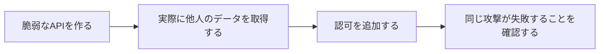
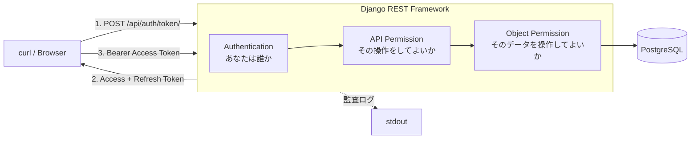
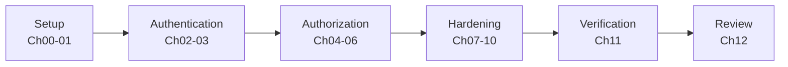

# Hands-on: 認証認可・セキュアAPI設計

「ログインできるAPI」と「安全なAPI」の違いを、脆弱なAPIを実際に作って攻撃し、修正して同じ攻撃が失敗することを確認しながら理解する。

## Overview

- **目的**：JWT認証だけではAPIが安全にならない理由を、動くコードと実際のレスポンスで確認する
- **学習・検証する内容**：認証 / API単位の認可 / データ単位の認可（BOLA・IDOR）/ Mass Assignment / Rate Limit / CORS / 監査ログ
- **想定読者**：REST APIを実装したことがあり、認証は入れたが認可の設計に自信がない人
- **前提知識**：HTTP / REST APIの基礎、Pythonの基礎。Djangoの経験は不要（コードはすべて掲載する）
- **必要環境**：Docker / Docker Compose / curl / Git。AWSアカウントは不要
- **所要時間**：約 120 分（Chapter 00〜12）
- **費用**：ローカル環境のみで完結するため、追加費用は発生しない

## このハンズオンの進め方

一般的なチュートリアルと違い、**最初にわざと脆弱なAPIを作る**。



攻撃が成立する状態を自分の手で見てから修正するため、「なぜその1行が必要なのか」が手順ではなく理由として残る。

脆弱な状態は環境変数（`INSECURE_*`）で切り替える。コードを書き換えて戻す必要はない。

> [!WARNING]
> `INSECURE_*` は学習用のフラグで、有効にすると意図的に防御が無効になる。ローカル環境以外では絶対に有効化しないこと。

## Architecture



このハンズオンの中心は、`Authentication` と `Object Permission` が**別の防御**であること。前者が通っても後者が抜けていれば、他人のデータは読める。

## Hands-on Flow



## Chapters

| 章 | 達成すること | 目安 |
|---|---|---|
| [Chapter 00: 環境構築](./chapters/chapter00-setup.md) | Docker で API と PostgreSQL を起動し、デモデータを投入する | 15分 |
| [Chapter 01: 認証なしAPIを見る](./chapters/chapter01-baseline.md) | 無防備なAPIを出発点として確認し、比較の基準を作る | 10分 |
| [Chapter 02: JWT認証を導入する](./chapters/chapter02-jwt-auth.md) | Token の有無で 401 / 200 が分かれることを確認する | 10分 |
| [Chapter 03: Access / Refresh Token](./chapters/chapter03-token-lifecycle.md) | Token を2種類に分ける理由を、期限切れと再発行で確認する | 15分 |
| [Chapter 04: RBACで操作を制限する](./chapters/chapter04-rbac.md) | 認証と認可の違いを、role による DELETE 制限で確認する | 10分 |
| [Chapter 05: BOLA / IDOR を再現する](./chapters/chapter05-bola.md) | 認証済みのまま他人のデータを取得し、脆弱性を成立させる | 15分 |
| [Chapter 06: Object-Level Authorization](./chapters/chapter06-object-authz.md) | 2層の防御を入れ、同じ攻撃が失敗することを確認する | 15分 |
| [Chapter 07: Mass Assignment 対策](./chapters/chapter07-mass-assignment.md) | クライアントが送った `owner` が無視されることを確認する | 10分 |
| [Chapter 08: Rate Limiting](./chapters/chapter08-rate-limit.md) | ログイン連打が 429 で遮断されることを確認する | 10分 |
| [Chapter 09: CORS を確認する](./chapters/chapter09-cors.md) | CORS がAPIの認可機構ではないことを curl で確認する | 10分 |
| [Chapter 10: 監査ログ](./chapters/chapter10-security-logging.md) | 攻撃の痕跡が残り、秘密情報が残らないことを確認する | 10分 |
| [Chapter 11: 正常系・異常系テスト](./chapters/chapter11-verification.md) | 15項目のテストをスクリプトで一括検証する | 10分 |
| [Chapter 12: 振り返りと設計判断](./chapters/chapter12-review.md) | 設計判断とトレードオフを整理し、環境を片付ける | 10分 |

## 登場するユーザーとデータ

Chapter 00 のシードコマンドで固定のIDとして作られる。以降の章はこのIDを前提にする。

| ID | ユーザー | role | 所有する Document |
|---:|---|---|---|
| 1 | alice | user | Document 1 |
| 2 | bob | user | Document 2 |
| 3 | root | admin | なし（全件にアクセスできる） |

パスワードは3人とも `Handson-Passw0rd!`（ローカル専用）。

## Repository Structure

```text
.
├── README.md                          # この文書
├── chapters/                          # 各章
├── docs/
│   └── verification.md                # 検証記録（実行結果の一次情報）
├── auth_authorization_secure_api_hands_on.md   # 原案
└── secure-api-hands-on/               # 実装一式
    ├── compose.yaml
    ├── .env.example                # .env はここからコピーして作る（.gitignore 済み）
    ├── app/
    │   ├── Dockerfile
    │   ├── pyproject.toml            # 依存の宣言（uv）
    │   ├── uv.lock                    # 依存の固定（uv sync --locked）
    │   ├── manage.py
    │   ├── config/                    # settings / urls / 監査ログ
    │   ├── accounts/                  # User（role付き）/ ログインAPI
    │   └── documents/                 # Document / 認可ポリシー
    └── scripts/
        ├── lib.sh
        ├── normal_test.sh             # 正常系テスト
        └── attack_test.sh             # 異常系テスト
```

## 検証環境

すべての手順は以下の環境で実行して確認した。結果は [docs/verification.md](./docs/verification.md) に記録している。

| 項目 | バージョン |
|---|---|
| Docker | 29.7.2 |
| Docker Compose | v5.5.0 |
| Python（コンテナ内） | 3.14.7（`python:3.14-slim`） |
| uv（コンテナ内） | 0.12.17 |
| Django | 6.1.1 |
| djangorestframework | 3.18.1 |
| djangorestframework-simplejwt | 5.5.1 |
| django-cors-headers | 4.9.0 |
| psycopg | 3.3.6 |
| PostgreSQL | 17.11（`postgres:17-alpine`） |

## このハンズオンが答える問い

1. JWTを発行すればAPIは安全になるのか → [Ch05](./chapters/chapter05-bola.md)
2. 認証済みユーザーならすべてのAPIを呼べてよいのか → [Ch04](./chapters/chapter04-rbac.md)
3. URLのIDを書き換えるだけで他人のデータを取得できないか → [Ch05](./chapters/chapter05-bola.md) / [Ch06](./chapters/chapter06-object-authz.md)
4. Admin / User の権限はどこで制御すべきか → [Ch04](./chapters/chapter04-rbac.md)
5. Access Token を盗まれた場合どうなるのか → [Ch03](./chapters/chapter03-token-lifecycle.md)
6. Token の有効期限を短くすると何が変わるのか → [Ch03](./chapters/chapter03-token-lifecycle.md)
7. APIへの総当たりをどう制限するのか → [Ch08](./chapters/chapter08-rate-limit.md)
8. CORS・認証・認可はそれぞれ何を守っているのか → [Ch09](./chapters/chapter09-cors.md)
