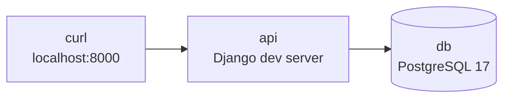

# Chapter 00: 環境構築

## この章の目的

Docker で Django API と PostgreSQL を起動し、以降の章が前提とする固定のユーザー・データを投入する。

## 現在地

**Setup** → Authentication → Authorization → Hardening → Verification → Review

## 完了条件

- [ ] `docker compose ps` で `api` と `db` が起動している
- [ ] `docker compose exec api uv run python manage.py seed_demo` が alice / bob / root を作成した
- [ ] `curl http://localhost:8000/api/documents/` が `401` を返す

---

## この章で起動するもの



`app/` はコンテナへボリュームマウントしているため、コードを編集すると開発サーバーが自動で再読み込みする。ただし `.env` の変更は再起動が必要になる（後述）。

---

## Step 1. リポジトリを配置する

### やること

`secure-api-hands-on/` 一式を手元に用意し、`.env` を作る。

### 実行

```bash
cd secure-api-hands-on
cp .env.example .env
```

### 期待結果

`.env` が作成される。中身は以下で、`INSECURE_*` はすべて `0`（防御が有効）になっている。

```bash
cat .env
```

```text
DJANGO_SECRET_KEY=insecure-local-only-key
DJANGO_DEBUG=1
POSTGRES_DB=secureapi
POSTGRES_USER=secureapi
POSTGRES_PASSWORD=secureapi-local-password
ACCESS_TOKEN_LIFETIME_MINUTES=30
REFRESH_TOKEN_LIFETIME_MINUTES=1440
LOGIN_RATE=5/min
CORS_ALLOWED_ORIGINS=https://app.example.com
INSECURE_NO_AUTH=0
INSECURE_OBJECT_ACCESS=0
INSECURE_OBJECT_PERMISSION=0
INSECURE_MASS_ASSIGNMENT=0
```

### なぜ行うのか

このハンズオンでは「防御がない状態」と「ある状態」を何度も往復する。コードを毎回書き換えると差分が分からなくなるため、切り替えを環境変数に寄せている。

---

## Step 2. コンテナを起動する

### やること

イメージをビルドし、API と PostgreSQL を起動する。

### 実行

```bash
docker compose build
docker compose up -d
docker compose ps
```

### 期待結果

```text
NAME                        IMAGE                     SERVICE   STATUS
secure-api-hands-on-api-1   secure-api-hands-on-api   api       Up
secure-api-hands-on-db-1    postgres:17-alpine        db        Up (healthy)
```

`db` の `healthy` を待ってから `api` が起動する（`compose.yaml` の `depends_on.condition`）。DB の起動待ちを手動で入れる必要はない。

---

## Step 3. マイグレーションを適用する

### やること

テーブルを作成する。

### 実行

```bash
docker compose exec api uv run python manage.py migrate
```

### 期待結果

```text
  Applying accounts.0001_initial... OK
  Applying admin.0001_initial... OK
  Applying documents.0001_initial... OK
  Applying sessions.0001_initial... OK
```

マイグレーションファイルはリポジトリに含めてあるため、`makemigrations` は不要になる。実行しても次のようになる。

```bash
docker compose exec api uv run python manage.py makemigrations accounts documents
```

```text
No changes detected in apps 'accounts', 'documents'
```

<details>
<summary>トラブル：<code>ValueError: Dependency on app with no migrations: accounts</code> が出る</summary>

マイグレーションファイルを削除した状態で開発サーバーが起動すると、このエラーで停止する。`makemigrations` で再生成したあと、開発サーバーを明示的に再起動すれば解消する。

```bash
docker compose exec api uv run python manage.py makemigrations accounts documents
docker compose exec api uv run python manage.py migrate
docker compose restart api
```

`runserver` は起動時にマイグレーションの整合性を確認するため、ファイルが無い状態では起動しきらない。

</details>

---

## Step 4. デモデータを投入する

### やること

固定IDのユーザーと Document を作る。

### 実行

```bash
docker compose exec api uv run python manage.py seed_demo
```

### 期待結果

```text
user  id=1 username=alice role=user
user  id=2 username=bob role=user
user  id=3 username=root role=admin
doc   id=1 owner=alice title=Alice Private Note
doc   id=2 owner=bob title=Bob Private Note
seed done (password: Handson-Passw0rd!)
```

### なぜ行うのか

以降の章は `GET /api/documents/2/` のように**IDを直接指定**して攻撃を再現する。IDがずれると手順が再現できないため、`seed_demo` は主キーを固定して作成し、そのあとシーケンスを実データに合わせ直している。

```python
# documents/management/commands/seed_demo.py
with connection.cursor() as cursor:
    for table in ("accounts_user", "documents_document"):
        cursor.execute(
            f"SELECT setval(pg_get_serial_sequence('{table}', 'id'), "
            f"COALESCE((SELECT MAX(id) FROM {table}), 1))"
        )
```

このリセットを省くと、以降の `POST /api/documents/` が主キー重複で失敗する。

`seed_demo` はべき等で、章の途中でデータを壊しても何度でも実行して初期状態へ戻せる。

---

## Step 5. 起動を確認する

### やること

API が応答し、既定では保護されていることを確認する。

### 実行

```bash
curl -i http://localhost:8000/api/documents/
```

### 期待結果

```http
HTTP/1.1 401 Unauthorized
```

```json
{"detail":"Authentication credentials were not provided."}
```

401 が返れば、Chapter 02 以降の状態から始まっていることになる。Chapter 01 では、これを一時的に無防備な状態へ戻して出発点を作る。

---

## 環境変数を変更するときの手順

以降の章で `.env` を編集したら、毎回この2つを実行する。`docker compose up -d` は変更された環境変数を検知してコンテナを作り直す（`restart` では反映されない）。

```bash
docker compose up -d api
curl -s -o /dev/null -w "%{http_code}\n" http://localhost:8000/api/documents/
```

2行目が `000` 以外（`401` など）を返せば、再起動が完了している。

---

## 次の章

[Chapter 01: 認証なしAPIを見る](./chapter01-baseline.md) で、比較の基準となる無防備な状態を確認する。
