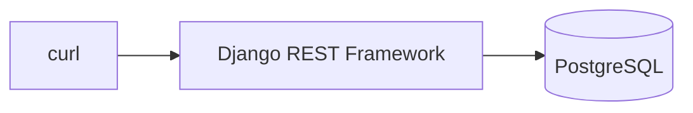

# Chapter 01: 認証なしAPIを見る

## この章の目的

防御を一度すべて外し、誰でも全データを取得できる状態を確認する。以降の章は「この状態から何を足すと何が守られたか」で読む。

## 現在地

**Setup** → Authentication → Authorization → Hardening → Verification → Review

## 完了条件

- [ ] `INSECURE_NO_AUTH=1` の状態で、Token なしに全 Document が取得できる
- [ ] `INSECURE_NO_AUTH=0` に戻すと `401` が返る

---

## この章の範囲



認証も認可も存在しない。リクエストはそのままデータベースへ届く。

---

## API の形

Document は次の情報を持つ。

```python
# documents/models.py
class Document(models.Model):
    title = models.CharField(max_length=200)
    content = models.TextField(blank=True)
    owner = models.ForeignKey(settings.AUTH_USER_MODEL, on_delete=models.CASCADE, related_name="documents")
    created_at = models.DateTimeField(auto_now_add=True)
```

公開するエンドポイントは以下。

```http
GET    /api/documents/
POST   /api/documents/
GET    /api/documents/{id}/
PATCH  /api/documents/{id}/
DELETE /api/documents/{id}/
```

`owner` を持っている点に注目しておく。この列があるのに参照しないことが、Chapter 05 の脆弱性の正体になる。

---

## Step 1. 防御を外す

### やること

`.env` の `INSECURE_NO_AUTH` を `1` にして、認証・認可を無効化する。

### 実行

```bash
cd secure-api-hands-on
sed -i 's|^INSECURE_NO_AUTH=.*|INSECURE_NO_AUTH=1|' .env
docker compose up -d api
```

### 期待結果

コンテナが作り直され、数秒で再び応答するようになる。

### なぜ行うのか

このフラグは View の3箇所を同時に無効化する。認証を外すと何が起きるかを、コードの側からも見ておく。

```python
# documents/views.py
def get_authenticators(self):
    if settings.INSECURE_NO_AUTH:
        return []                      # Token を一切見ない
    return super().get_authenticators()

def get_permissions(self):
    if settings.INSECURE_NO_AUTH:
        return [AllowAny()]            # 誰でも通す
    return super().get_permissions()

def get_queryset(self):
    if settings.INSECURE_NO_AUTH or settings.INSECURE_OBJECT_ACCESS:
        return Document.objects.all()  # 全件返す
    ...
```

---

## Step 2. 認証なしでデータを取得する

### やること

Authorization ヘッダを付けずに一覧を取得する。

### 実行

```bash
curl -s http://localhost:8000/api/documents/
```

### 期待結果

```json
[{"id":1,"title":"Alice Private Note","content":"alice しか読めないはずの内容","owner":1,"created_at":"2026-09-16T06:20:35.410365Z"},
 {"id":2,"title":"Bob Private Note","content":"bob しか読めないはずの内容","owner":2,"created_at":"2026-09-16T06:20:35.410982Z"}]
```

ステータスは `200`。alice のデータも bob のデータも、誰であるかを名乗らないまま取得できる。

### なぜ行うのか

この出力が、以降のすべての章の比較対象になる。「何も足していないAPIは、全ユーザーの全データを匿名で返す」という事実を一次情報として持っておく。

---

## Step 3. 防御を戻す

### やること

フラグを `0` に戻し、既定の状態へ復帰する。

### 実行

```bash
sed -i 's|^INSECURE_NO_AUTH=.*|INSECURE_NO_AUTH=0|' .env
docker compose up -d api
curl -s -i http://localhost:8000/api/documents/ | head -1
```

### 期待結果

```http
HTTP/1.1 401 Unauthorized
```

---

## この章で確認したこと

| 状態 | Token なしの `GET /api/documents/` |
|---|---|
| `INSECURE_NO_AUTH=1` | `200` / 全ユーザーの全件 |
| `INSECURE_NO_AUTH=0` | `401` |

この差を作っているのが次の章の JWT 認証。ただし JWT が埋めるのは「あなたは誰か」だけで、「どのデータを見てよいか」はまだ何も決まっていない。

---

## 次の章

[Chapter 02: JWT認証を導入する](./chapter02-jwt-auth.md)
