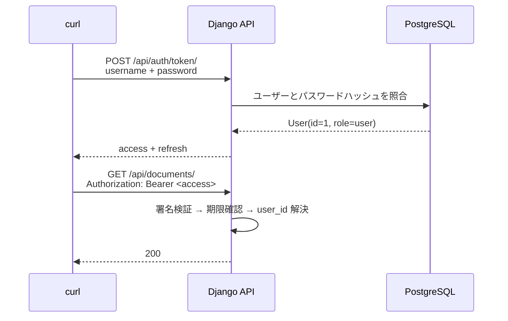

# Chapter 02: JWT認証を導入する

## この章の目的

ログインして Access Token を受け取り、Token の有無で API の応答が `401` と `200` に分かれることを確認する。

## 現在地

Setup → **Authentication** → Authorization → Hardening → Verification → Review

## 完了条件

- [ ] `POST /api/auth/token/` が access / refresh の2つの Token を返す
- [ ] Token なしのリクエストが `401` になる
- [ ] Token ありのリクエストが `200` になる
- [ ] 改ざんした Token が `401` になる

---

## この章の範囲



---

## 設定

認証クラスを SimpleJWT に、既定の権限を「認証済みのみ」にしている。

```python
# config/settings.py
REST_FRAMEWORK = {
    "DEFAULT_AUTHENTICATION_CLASSES": [
        "rest_framework_simplejwt.authentication.JWTAuthentication",
    ],
    "DEFAULT_PERMISSION_CLASSES": [
        "rest_framework.permissions.IsAuthenticated",
    ],
    ...
}
```

エンドポイントは2つ。

```http
POST /api/auth/token/          # ログイン
POST /api/auth/token/refresh/  # Access Token の再発行（Chapter 03）
```

---

## Step 1. ログインする

### やること

alice の資格情報で Token を取得する。

### 実行

```bash
curl -s -X POST http://localhost:8000/api/auth/token/ \
  -H "Content-Type: application/json" \
  -d '{"username":"alice","password":"Handson-Passw0rd!"}'
```

### 期待結果

ステータス `200`。

```json
{
  "refresh": "eyJhbGciOiJIUzI1NiIsInR5cCI6IkpXVCJ9.eyJ0b2tlbl90eXBlIjoicmVmcmVzaCIs...",
  "access": "eyJhbGciOiJIUzI1NiIsInR5cCI6IkpXVCJ9.eyJ0b2tlbl90eXBlIjoiYWNjZXNzIiwi..."
}
```

以降の手順で使うため、シェル変数に入れておく。

```bash
ALICE=$(curl -s -X POST http://localhost:8000/api/auth/token/ \
  -H "Content-Type: application/json" \
  -d '{"username":"alice","password":"Handson-Passw0rd!"}' \
  | python -c "import sys,json;print(json.load(sys.stdin)['access'])")
```

> [!NOTE]
> ログインには Rate Limit がかかっている（既定 `5/min`、Chapter 08 で扱う）。試行を繰り返して `429` が返るようになったら、1分待つか `.env` の `LOGIN_RATE` を一時的に `1000/min` にする。

---

## Step 2. ログインに失敗させる

### やること

誤ったパスワードで応答を確認する。

### 実行

```bash
curl -s -X POST http://localhost:8000/api/auth/token/ \
  -H "Content-Type: application/json" \
  -d '{"username":"alice","password":"wrong-password"}'
```

### 期待結果

ステータス `401`。

```json
{"detail":"No active account found with the given credentials"}
```

「ユーザーが存在しない」と「パスワードが違う」を区別しないメッセージになっている。区別すると、ユーザー名の存在を総当たりで列挙できてしまう。

---

## Step 3. Token を付けて API を呼ぶ

### やること

Token の有無で応答がどう変わるかを比べる。

### 実行

```bash
# Token なし
curl -s -i http://localhost:8000/api/documents/ | head -1

# Token あり
curl -s -i http://localhost:8000/api/documents/ \
  -H "Authorization: Bearer ${ALICE}" | head -1
```

### 期待結果

```http
HTTP/1.1 401 Unauthorized
HTTP/1.1 200 OK
```

Token ありの本文は、alice が所有する Document だけになる。

```json
[{"id":1,"title":"Alice Private Note","content":"alice しか読めないはずの内容","owner":1,"created_at":"2026-09-16T06:18:51.301220Z"}]
```

Chapter 01 では2件返っていたものが1件になっている。この絞り込みは JWT ではなく Chapter 06 で扱う QuerySet のスコープが効いている。**認証を入れただけではこうならない**ことを Chapter 05 で確認する。

---

## Step 4. Token を改ざんする

### やること

Token の末尾を書き換えて送る。

### 実行

```bash
curl -s http://localhost:8000/api/documents/ \
  -H "Authorization: Bearer ${ALICE}tampered"
```

### 期待結果

ステータス `401`。

```json
{"detail":"Given token not valid for any token type","code":"token_not_valid",
 "messages":[{"token_class":"AccessToken","token_type":"access","message":"Token is invalid"}]}
```

### なぜ行うのか

JWT は暗号化されておらず、payload は誰でも読める。改ざんを防いでいるのは**署名**であって秘匿ではない。`DJANGO_SECRET_KEY` を知られれば任意の Token を偽造できるため、この鍵はパスワードと同じ扱いになる。

---

## Step 5. 自分が誰として認識されているかを確認する

### やること

Token がどのユーザーへ解決されたかを返すエンドポイントを叩く。

### 実行

```bash
curl -s http://localhost:8000/api/auth/me/ -H "Authorization: Bearer ${ALICE}"
```

### 期待結果

```json
{"id":1,"username":"alice","role":"user"}
```

`role` は Chapter 04 の RBAC で使う。Django 標準の `is_staff` / `is_superuser` は管理画面用の権限なので、APIの認可には別のフィールドを持たせている。

```python
# accounts/models.py
class User(AbstractUser):
    role = models.CharField(max_length=16, choices=Role.choices, default=Role.USER)
```

---

## この章で確認したこと

| リクエスト | ステータス |
|---|---|
| 正しい資格情報でログイン | `200` |
| 誤ったパスワードでログイン | `401` |
| Token なしで API | `401` |
| 正しい Token で API | `200` |
| 改ざんした Token で API | `401` |

ここまでで守られたのは「名乗っていない相手を入れない」ことだけ。入ってきた相手が**何をしてよいか**はまだ決めていない。

---

## 次の章

[Chapter 03: Access / Refresh Token](./chapter03-token-lifecycle.md)
