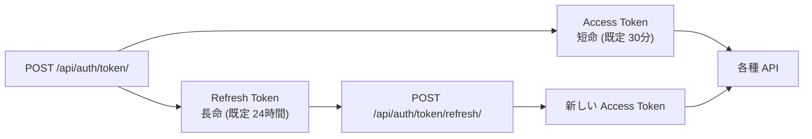

# Chapter 03: Access / Refresh Token

## この章の目的

Access Token を期限切れにして `401` を受け取り、Refresh Token から再発行して復帰するまでを実際に通す。Token を2種類に分ける理由を、挙動として確認する。

## 現在地

Setup → **Authentication** → Authorization → Hardening → Verification → Review

## 完了条件

- [ ] Access Token の payload を自分でデコードして中身を確認した
- [ ] 期限切れの Access Token が `401` になる
- [ ] Refresh Token から新しい Access Token を取得し、`200` へ復帰する

---

## この章の範囲



| Token | 送る先 | 寿命 | 盗まれたときの影響 |
|---|---|---|---|
| Access | すべての API リクエスト | 短い | 期限が切れるまで悪用される |
| Refresh | 再発行エンドポイントのみ | 長い | 長期間、新しい Access Token を作られ続ける |

Access Token は毎リクエスト飛ぶので露出機会が多い。そのぶん寿命を短くする。Refresh Token は露出機会が少ないぶん長く持たせる。この非対称が Token を2つに分ける理由になる。

---

## Step 1. Access Token の中身を見る

### やること

JWT の payload（2番目のセグメント）を Base64URL デコードする。

### 実行

```bash
ALICE=$(curl -s -X POST http://localhost:8000/api/auth/token/ \
  -H "Content-Type: application/json" \
  -d '{"username":"alice","password":"Handson-Passw0rd!"}' \
  | python -c "import sys,json;print(json.load(sys.stdin)['access'])")

python -c "
import base64, json, sys
payload = '${ALICE}'.split('.')[1]
payload += '=' * (-len(payload) % 4)
print(json.dumps(json.loads(base64.urlsafe_b64decode(payload)), indent=2))
"
```

### 期待結果

```json
{
  "token_type": "access",
  "exp": 1789539972,
  "iat": 1789539912,
  "jti": "3e6e0f47d64849cd85f343f78f21b3b7",
  "user_id": "1"
}
```

### なぜ行うのか

payload は署名されているだけで暗号化されていない。**誰でも読める**。

ここから2つの帰結が出る。

1. Token に個人情報や秘密を入れてはいけない
2. サーバーは `user_id` を Token から読むだけで、毎回 DB のセッションを引かない（Stateless）

2つ目が JWT の利点であり、同時に「一度発行した Token をサーバー側から即座に無効化できない」という弱点でもある。

---

## Step 2. Access Token の寿命を1分にする

### やること

期限切れを現実的な待ち時間で観測できるよう、寿命を縮める。

### 実行

```bash
cd secure-api-hands-on
sed -i 's|^ACCESS_TOKEN_LIFETIME_MINUTES=.*|ACCESS_TOKEN_LIFETIME_MINUTES=1|' .env
docker compose up -d api
```

### 期待結果

再起動後、新しく発行される Access Token の `exp - iat` が 60 秒になる。

該当する設定は以下。

```python
# config/settings.py
SIMPLE_JWT = {
    "ACCESS_TOKEN_LIFETIME": timedelta(minutes=env_int("ACCESS_TOKEN_LIFETIME_MINUTES", 30)),
    "REFRESH_TOKEN_LIFETIME": timedelta(minutes=env_int("REFRESH_TOKEN_LIFETIME_MINUTES", 1440)),
    "ROTATE_REFRESH_TOKENS": False,
    "AUTH_HEADER_TYPES": ("Bearer",),
}
```

---

## Step 3. 期限切れを観測する

### やること

Token を取り直し、発行直後と70秒後で同じリクエストを比べる。

### 実行

```bash
RESP=$(curl -s -X POST http://localhost:8000/api/auth/token/ \
  -H "Content-Type: application/json" \
  -d '{"username":"alice","password":"Handson-Passw0rd!"}')
ACCESS=$(echo "$RESP"  | python -c "import sys,json;print(json.load(sys.stdin)['access'])")
REFRESH=$(echo "$RESP" | python -c "import sys,json;print(json.load(sys.stdin)['refresh'])")

# 発行直後
curl -s -o /dev/null -w "just issued : %{http_code}\n" \
  http://localhost:8000/api/documents/ -H "Authorization: Bearer ${ACCESS}"

sleep 70

# 70秒後
curl -s http://localhost:8000/api/documents/ -H "Authorization: Bearer ${ACCESS}"
```

### 期待結果

```text
just issued : 200
```

70秒後：

```json
{"detail":"Given token not valid for any token type","code":"token_not_valid",
 "messages":[{"token_class":"AccessToken","token_type":"access","message":"Token is expired"}]}
```

ステータスは `401`。Chapter 02 の改ざん Token と同じ `401` だが、`messages[].message` が `Token is invalid` ではなく `Token is expired` になっている点が違う。

---

## Step 4. Refresh Token で再発行する

### やること

ログインし直さずに、新しい Access Token を得る。

### 実行

```bash
NEW=$(curl -s -X POST http://localhost:8000/api/auth/token/refresh/ \
  -H "Content-Type: application/json" \
  -d "{\"refresh\":\"${REFRESH}\"}" \
  | python -c "import sys,json;print(json.load(sys.stdin)['access'])")

curl -s -o /dev/null -w "refreshed : %{http_code}\n" \
  http://localhost:8000/api/documents/ -H "Authorization: Bearer ${NEW}"
```

### 期待結果

```text
refreshed : 200
```

再発行のレスポンスに含まれるキーは `access` だけ。

```json
{"access":"eyJhbGciOiJIUzI1NiIsInR5cCI6IkpXVCJ9..."}
```

`ROTATE_REFRESH_TOKENS=False` のため、Refresh Token は使っても入れ替わらない。`True` にすると再発行のたびに新しい Refresh Token が返り、古いものを無効化できる（盗難時の悪用期間を縮められる）。

### なぜ行うのか

ユーザーから見れば「30分ごとに再ログインさせられない」ための仕組み。設計から見れば「Access Token の寿命を短くしても使い勝手が落ちない」ようにするための仕組み。後者が本来の目的になる。

---

## Step 5. 設定を戻す

```bash
sed -i 's|^ACCESS_TOKEN_LIFETIME_MINUTES=.*|ACCESS_TOKEN_LIFETIME_MINUTES=30|' .env
docker compose up -d api
```

---

## Token を盗まれたらどうなるか

このハンズオンの構成では、次のようになる。

| 盗まれたもの | 影響 | 止める手段 |
|---|---|---|
| Access Token | 残りの寿命のあいだ、その利用者として全APIを呼べる | 期限切れを待つしかない |
| Refresh Token | Refresh Token の寿命のあいだ、Access Token を作り続けられる | Blacklist を導入して失効させる |

「期限切れを待つしかない」が Stateless の代償になる。即時失効が要件なら、次のいずれかを足す必要がある。

- `rest_framework_simplejwt.token_blacklist` を有効にして Refresh Token を失効可能にする
- Access Token の寿命をさらに短くする（数分）
- 重要操作の直前だけ再認証を要求する

寿命を短くするほど安全に近づくが、Refresh の回数が増えて認証エンドポイントの負荷が上がる。どこで折り合うかが設計判断になる。

---

## この章で確認したこと

| 状態 | ステータス | `messages[].message` |
|---|---|---|
| 発行直後の Access Token | `200` | — |
| 70秒後（寿命1分） | `401` | `Token is expired` |
| 改ざんした Token（Ch02） | `401` | `Token is invalid` |
| Refresh 後の Access Token | `200` | — |

---

## 次の章

[Chapter 04: RBACで操作を制限する](./chapter04-rbac.md)
