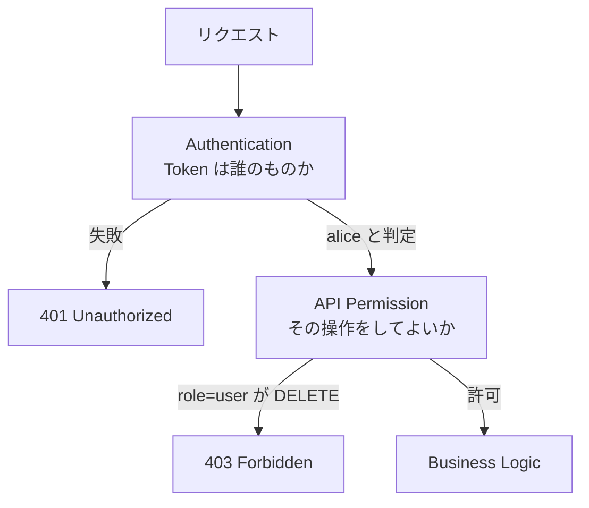

# Chapter 04: RBACで操作を制限する

## この章の目的

同じ「認証済み」でも、role によって呼べる操作が変わることを確認する。認証と認可が別の層であることを、`403` という応答で見る。

## 現在地

Setup → Authentication → **Authorization** → Hardening → Verification → Review

## 完了条件

- [ ] role=user の DELETE が `403` になる
- [ ] role=admin の DELETE が `204` になる
- [ ] `403` と `401` の意味の違いを説明できる

---

## この章の範囲



`401` と `403` は違うことを言っている。

| ステータス | 意味 |
|---|---|
| `401 Unauthorized` | 誰だか分からない。名乗り直してほしい |
| `403 Forbidden` | 誰かは分かった。その上で、あなたには許可されていない |

---

## 決めるルール

| 操作 | role=user | role=admin |
|---|:---:|:---:|
| GET（一覧・取得） | ○ | ○ |
| POST（作成） | ○ | ○ |
| PATCH（更新） | ○ | ○ |
| DELETE（削除） | × | ○ |

---

## 実装

判定は View の中の `if` ではなく、Permission クラスに置く。

```python
# documents/permissions.py
class DocumentAccessPolicy(BasePermission):
    def has_permission(self, request, view):
        user = request.user
        if not (user and user.is_authenticated):
            return False

        # DELETE は admin ロールのみ
        if request.method == "DELETE":
            self.message = "DELETE には admin ロールが必要です。"
            return user.is_admin_role

        return True
```

`has_permission` は**リクエストの種類**に対する判定で、対象データを1件も読まずに答えが出る。「この人はそもそも削除という操作をしてよいか」だけを見ている。

<details>
<summary>なぜ View の中の if ではなく Permission クラスに置くのか</summary>

View に書くと、エンドポイントが増えるたびに判定が分散し、どこかで書き忘れても動いてしまう。Permission クラスに切り出すと、判定は1箇所に集まり、どの View に適用されているかが `permission_classes` で一覧できる。

また、DRF は `has_permission` が `False` を返したとき自動的に `403` を返す。ステータスコードの選択を各 View で間違える余地がなくなる。

</details>

---

## Step 1. role を確認する

### やること

alice と root がそれぞれどの role として認識されるかを見る。

### 実行

```bash
ALICE=$(curl -s -X POST http://localhost:8000/api/auth/token/ \
  -H "Content-Type: application/json" \
  -d '{"username":"alice","password":"Handson-Passw0rd!"}' \
  | python -c "import sys,json;print(json.load(sys.stdin)['access'])")
ROOT=$(curl -s -X POST http://localhost:8000/api/auth/token/ \
  -H "Content-Type: application/json" \
  -d '{"username":"root","password":"Handson-Passw0rd!"}' \
  | python -c "import sys,json;print(json.load(sys.stdin)['access'])")

curl -s http://localhost:8000/api/auth/me/ -H "Authorization: Bearer ${ALICE}"; echo
curl -s http://localhost:8000/api/auth/me/ -H "Authorization: Bearer ${ROOT}"; echo
```

### 期待結果

```json
{"id":1,"username":"alice","role":"user"}
{"id":3,"username":"root","role":"admin"}
```

---

## Step 2. role=user で DELETE する

### やること

alice が**自分の** Document 1 を削除しようとする。

### 実行

```bash
curl -s -X DELETE http://localhost:8000/api/documents/1/ \
  -H "Authorization: Bearer ${ALICE}" -w "\nstatus=%{http_code}\n"
```

### 期待結果

```json
{"detail":"DELETE には admin ロールが必要です。"}
```

```text
status=403
```

所有者本人であっても拒否される。`has_permission` は所有者かどうかを見ていないため、データを読む前の段階で止まっている。

---

## Step 3. role=admin で DELETE する

### やること

root が同じ Document を削除する。

### 実行

```bash
curl -s -o /dev/null -w "status=%{http_code}\n" \
  -X DELETE http://localhost:8000/api/documents/1/ \
  -H "Authorization: Bearer ${ROOT}"
```

### 期待結果

```text
status=204
```

本文は空（`204 No Content`）。

### 後始末

次の章で Document 1 を使うため、データを戻しておく。

```bash
docker compose exec api uv run python manage.py seed_demo
```

---

## admin は他人のデータも見えてよいのか

このハンズオンでは、admin だけ全件を扱えるようにしている。

```python
# documents/views.py
def get_queryset(self):
    user = self.request.user
    if user.is_admin_role:
        return Document.objects.all()
    return Document.objects.filter(owner=user)
```

```python
# documents/permissions.py
def has_object_permission(self, request, view, obj):
    user = request.user
    if user.is_admin_role:
        return True
    return obj.owner_id == user.id
```

これは「運用者は全データを見られる」という設計判断であって、自動的に正しいわけではない。医療・金融のように、管理者であっても他人のデータを無制限に閲覧させない要件もある。その場合は admin にも所有者チェックを適用し、閲覧を別の承認フローに乗せる。

admin を特別扱いする以上、admin の操作は必ず記録に残す必要がある（Chapter 10）。

---

## RBAC の限界

role が増えると、組み合わせが急速に増える。

```text
Admin / User / Viewer / Auditor / TenantAdmin / BillingAdmin ...
```

「部門Aの管理者だが部門Bでは閲覧のみ」のような条件が入ると、role の数が条件の数だけ増えていく（Role Explosion）。そうなったら、role ではなく属性で判定する ABAC やポリシーエンジンへの移行を検討する段階になる。

---

## この章で確認したこと

| 操作 | 実行者 | ステータス |
|---|---|---|
| DELETE /api/documents/1/ | alice（role=user、所有者本人） | `403` |
| DELETE /api/documents/1/ | root（role=admin） | `204` |

ここまでで「誰か」と「何をしてよいか」は決まった。残るのは「どのデータに対して」。次の章で、そこが抜けているとどうなるかを実際に見る。

---

## 次の章

[Chapter 05: BOLA / IDOR を再現する](./chapter05-bola.md)
