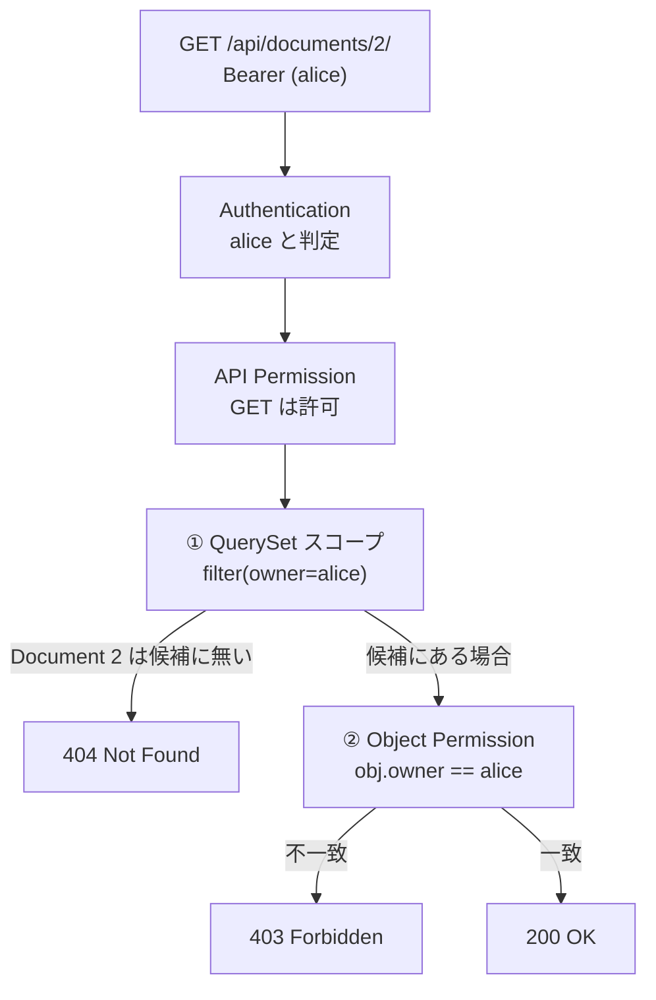

# Chapter 06: Object-Level Authorization

## この章の目的

Chapter 05 の攻撃を防ぐ2層の防御を入れ、同じリクエストが失敗することを確認する。さらに、**どちらか片方だけでは不十分**であることを実測で確かめる。

## 現在地

Setup → Authentication → **Authorization** → Hardening → Verification → Review

## 完了条件

- [ ] alice の `GET /api/documents/2/` が `404` になる
- [ ] alice の一覧が自分の1件だけになる
- [ ] 2層の防御それぞれが、どのケースを止めているか説明できる

---

## 2層の防御



| 層 | 実装 | 止めるもの |
|---|---|---|
| ① QuerySet スコープ | `get_queryset()` | **一覧**と詳細の両方。そもそも取得対象に含めない |
| ② Object Permission | `has_object_permission()` | **詳細・更新・削除**。取得後に所有者を照合する |

①だけ、②だけでは穴が残る。理由は Step 3 で数字を見る。

---

## Step 1. 防御を有効にする

### やること

Chapter 05 で外した2つのフラグを戻し、データを初期化する。

### 実行

```bash
cd secure-api-hands-on
sed -i 's|^INSECURE_OBJECT_ACCESS=.*|INSECURE_OBJECT_ACCESS=0|; s|^INSECURE_OBJECT_PERMISSION=.*|INSECURE_OBJECT_PERMISSION=0|' .env
docker compose up -d api
docker compose exec api uv run python manage.py seed_demo
```

### 期待結果

```text
user  id=1 username=alice role=user
user  id=2 username=bob role=user
user  id=3 username=root role=admin
doc   id=1 owner=alice title=Alice Private Note
doc   id=2 owner=bob title=Bob Private Note
seed done (password: Handson-Passw0rd!)
```

Chapter 05 で `hijacked by alice` に書き換えた Document 2 が元に戻っている。

---

## 実装の中身

### ① QuerySet を所有者で絞る

```python
# documents/views.py
def get_queryset(self):
    """データ取得の時点でユーザー単位へ絞り込む（防御の1段目）。"""
    user = self.request.user
    if user.is_admin_role:
        return Document.objects.all()
    return Document.objects.filter(owner=user)
```

Chapter 05 の `Document.objects.all()` との差は1行だが、意味は「全データから探す」から「この人のデータから探す」への変更になる。

他人の ID を指定した場合、DRF の `get_object()` はこの QuerySet の中から探すため該当なしとなり、`404` を返す。

### ② 所有者を照合する

```python
# documents/permissions.py
def has_object_permission(self, request, view, obj):
    user = request.user
    if user.is_admin_role:
        return True

    allowed = obj.owner_id == user.id
    if not allowed and request.method in SAFE_METHODS:
        self.message = "このリソースの所有者ではありません。"
    return allowed
```

①があるなら②は不要に見えるが、そうではない。`get_queryset()` を書き換えたり、別の View から同じモデルを扱ったりしたときに、②が最後の砦として残る。逆に②だけでも足りない（Step 3）。

---

## Step 2. 同じ攻撃を再実行する

### やること

Chapter 05 とまったく同じリクエストを送る。

### 実行

```bash
ALICE=$(curl -s -X POST http://localhost:8000/api/auth/token/ \
  -H "Content-Type: application/json" \
  -d '{"username":"alice","password":"Handson-Passw0rd!"}' \
  | python -c "import sys,json;print(json.load(sys.stdin)['access'])")

echo "--- 自分の Document 1 ---"
curl -s http://localhost:8000/api/documents/1/ -H "Authorization: Bearer ${ALICE}" -w "\nstatus=%{http_code}\n"

echo "--- 他人の Document 2 ---"
curl -s http://localhost:8000/api/documents/2/ -H "Authorization: Bearer ${ALICE}" -w "\nstatus=%{http_code}\n"

echo "--- 他人の Document 2 を PATCH ---"
curl -s -X PATCH http://localhost:8000/api/documents/2/ \
  -H "Authorization: Bearer ${ALICE}" -H "Content-Type: application/json" \
  -d '{"title":"hijacked by alice"}' -w "\nstatus=%{http_code}\n"

echo "--- 一覧 ---"
curl -s http://localhost:8000/api/documents/ -H "Authorization: Bearer ${ALICE}" \
  | python -c "import sys,json;[print(f\"id={d['id']} owner={d['owner']}\") for d in json.load(sys.stdin)]"
```

### 期待結果

```text
--- 自分の Document 1 ---
{"id":1,"title":"Alice Private Note","content":"alice しか読めないはずの内容","owner":1,"created_at":"..."}
status=200

--- 他人の Document 2 ---
{"detail":"No Document matches the given query."}
status=404

--- 他人の Document 2 を PATCH ---
{"detail":"No Document matches the given query."}
status=404

--- 一覧 ---
id=1 owner=1
```

Chapter 05 の4行すべてが反転した。alice 自身の操作は何も壊れていない。

---

## Step 3. 片方だけではどうなるか

### やること

2つのフラグを4通りに組み合わせ、それぞれの挙動を比べる。

2つのフラグは**防御を外すスイッチ**で、`1` で無効化、`0` で有効になる。`1` を渡すほど Chapter 05 の状態に近づく。

| 組み合わせ | `INSECURE_OBJECT_ACCESS`（①） | `INSECURE_OBJECT_PERMISSION`（②） |
|---|---|---|
| [A] 両方なし | `1`（① を外す） | `1`（② を外す） |
| [B] QuerySet のみ | `0` | `1` |
| [C] Object Permission のみ | `1` | `0` |
| [D] 両方あり | `0` | `0` |

下のスクリプトは2つの関数でできている。`apply` が `.env` のフラグを書き換えて api を再起動し、`probe` が alice として **一覧の件数** と **他人の Document 2 への GET のステータス** を測る。この2つの数字だけを [A] 〜 [D] で比べる。件数は `1`（自分の分だけ）が正しく、`2` なら bob の Document まで見えている。

### 実行

```bash
probe() {  # alice として2つの数字を測る
  # alice のアクセストークンを取得
  ALICE=$(curl -s -X POST http://localhost:8000/api/auth/token/ \
    -H "Content-Type: application/json" \
    -d '{"username":"alice","password":"Handson-Passw0rd!"}' \
    | python -c "import sys,json;print(json.load(sys.stdin)['access'])")
  # 一覧に何件見えるか（① が効いていれば1件）
  COUNT=$(curl -s http://localhost:8000/api/documents/ -H "Authorization: Bearer ${ALICE}" \
    | python -c "import sys,json;print(len(json.load(sys.stdin)))")
  # 他人の Document 2 を GET したときのステータス
  CODE=$(curl -s -o /dev/null -w "%{http_code}" http://localhost:8000/api/documents/2/ \
    -H "Authorization: Bearer ${ALICE}")
  echo "  一覧の件数=${COUNT}  GET /documents/2/ status=${CODE}"
}

apply() {  # $1: INSECURE_OBJECT_ACCESS  $2: INSECURE_OBJECT_PERMISSION
  # .env のフラグを書き換える
  sed -i "s|^INSECURE_OBJECT_ACCESS=.*|INSECURE_OBJECT_ACCESS=$1|; s|^INSECURE_OBJECT_PERMISSION=.*|INSECURE_OBJECT_PERMISSION=$2|" .env
  docker compose up -d api >/dev/null 2>&1  # 新しい設定で api を再起動
  until curl -s -o /dev/null http://localhost:8000/api/documents/; do :; done  # 起動完了まで待つ
}

echo "[A] 両方なし";                apply 1 1; probe
echo "[B] QuerySet のみ";           apply 0 1; probe
echo "[C] Object Permission のみ";  apply 1 0; probe
echo "[D] 両方あり（既定）";        apply 0 0; probe
```

> [!NOTE]
> ログインを8回行うため、`LOGIN_RATE` を一時的に上げておく。
> `sed -i 's|^LOGIN_RATE=.*|LOGIN_RATE=1000/min|' .env`（確認後に `5/min` へ戻す）

### 期待結果

```text
[A] 両方なし
  一覧の件数=2  GET /documents/2/ status=200
[B] QuerySet のみ
  一覧の件数=1  GET /documents/2/ status=404
[C] Object Permission のみ
  一覧の件数=2  GET /documents/2/ status=403
[D] 両方あり（既定）
  一覧の件数=1  GET /documents/2/ status=404
```

整理すると次のようになる。

| 組み合わせ | 一覧 | 詳細取得 | 判定 |
|---|---|---|---|
| [A] 両方なし | **全件漏洩** | **200（漏洩）** | Chapter 05 の状態 |
| [B] QuerySet のみ | 自分の分 | `404` | 防げている |
| [C] Object Permission のみ | **全件漏洩** | `403` | **一覧から漏れる** |
| [D] 両方あり | 自分の分 | `404` | 既定の実装 |

### なぜ行うのか

[C] が要点になる。`has_object_permission` を書いたので「認可を実装した」と考えたくなるが、**一覧エンドポイントでは呼ばれない**。DRF が `has_object_permission` を呼ぶのは `get_object()` で1件を特定したときだけで、`list()` はそれを通らない。

詳細取得のテストだけ書いていると `403` が返るので合格し、一覧の漏洩はテストをすり抜ける。「1件ずつのチェック」と「そもそも取得しない」は別の対策で、両方いる。

> [!NOTE]
> 検証後は `LOGIN_RATE` を `5/min` に戻し、`docker compose up -d api` を実行する。

---

## 404 と 403 のどちらを返すか

他人のリソースへのアクセスに対して、返し方は2通りある。

| 応答 | 伝わること | 向いている場面 |
|---|---|---|
| `404 Not Found` | 存在するかどうかも分からない | ID の存在自体を秘匿したい（例：ユーザーIDやファイルID） |
| `403 Forbidden` | 存在するが権限がない | 共有申請など、存在を前提にした導線がある |

`404` は**存在の有無を漏らさない**ぶん安全側になる。連番 ID の場合、`403` が返ると「その ID は存在する」と分かり、総当たりで有効な ID を列挙できてしまう。

このハンズオンでは QuerySet スコープを1段目に置いているため、既定では `404` になる。どちらが正しいかは要件次第で、重要なのは**意図して選ぶ**こと。既定の挙動に任せて偶然どちらかになっている状態は避ける。

---

## この章で確認したこと

| 操作（alice の Token） | Chapter 05 | Chapter 06 |
|---|---|---|
| GET /api/documents/1/（自分） | `200` | `200` |
| GET /api/documents/2/（他人） | `200` 漏洩 | `404` |
| PATCH /api/documents/2/（他人） | `200` 改ざん | `404` |
| GET /api/documents/（一覧） | 全件 | 自分の1件 |

認証（Ch02）・API認可（Ch04）・オブジェクト認可（Ch06）が揃って、初めて「他人のデータに触れない」が成立する。

---

## 次の章

[Chapter 07: Mass Assignment 対策](./chapter07-mass-assignment.md)
