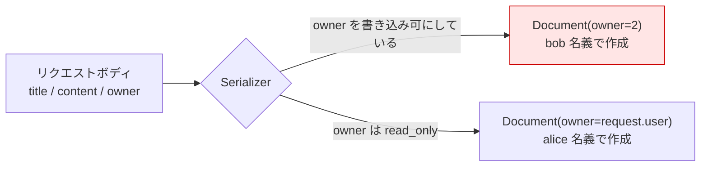

# Chapter 07: Mass Assignment 対策

## この章の目的

クライアントが送った `owner` を API が受け入れると何が起きるかを再現し、サーバー側で `owner` を決める実装との差を確認する。

## 現在地

Setup → Authentication → Authorization → **Hardening** → Verification → Review

## 完了条件

- [ ] `INSECURE_MASS_ASSIGNMENT=1` で、alice が bob 名義の Document を作れる
- [ ] 既定の実装では、送った `owner` が無視される
- [ ] Chapter 06 の認可があっても、この攻撃は止まらないことを説明できる

---

## Mass Assignment とは

リクエストボディの項目を、そのままモデルの属性へ流し込んでしまう問題を指す。攻撃者は、API のドキュメントに載っていない項目を推測して送り込む。



狙われやすいのは、`owner` / `user_id` / `role` / `is_admin` / `tenant_id` / `price` / `status` のように、**本来サーバーが決める値**を持つ項目。

---

## Chapter 06 の認可では止まらない

Chapter 06 で入れた2層の防御は、**既存のデータ**に対する読み書きを守る。Mass Assignment は**新しいデータを作るとき**に owner を偽るので、所有者チェックの対象にならない。

| 攻撃 | 守るもの |
|---|---|
| BOLA（Ch05） | 既存データの owner を照合する |
| Mass Assignment（この章） | 新規データの owner を誰が決めるかを固定する |

どちらも「`owner` という列を信頼できる状態に保つ」ための対策だが、防ぐ場所が違う。

---

## Step 1. 防御を外す

### やること

`owner` を書き込み可能にする。

### 実行

```bash
cd secure-api-hands-on
sed -i 's|^INSECURE_MASS_ASSIGNMENT=.*|INSECURE_MASS_ASSIGNMENT=1|' .env
docker compose up -d api
docker compose exec api uv run python manage.py seed_demo
```

このフラグが有効なとき、Serializer と View は実質こうなる。

```python
# documents/serializers.py （INSECURE_MASS_ASSIGNMENT=1 のとき）
fields["owner"] = serializers.PrimaryKeyRelatedField(queryset=get_user_model().objects.all())

# documents/views.py
def perform_create(self, serializer):
    serializer.save()   # リクエストボディの owner がそのまま使われる
```

---

## Step 2. 他人名義のデータを作る

### やること

alice の Token で、`owner` に bob の ID（2）を指定して POST する。

### 実行

```bash
ALICE=$(curl -s -X POST http://localhost:8000/api/auth/token/ \
  -H "Content-Type: application/json" \
  -d '{"username":"alice","password":"Handson-Passw0rd!"}' \
  | python -c "import sys,json;print(json.load(sys.stdin)['access'])")

curl -s -X POST http://localhost:8000/api/documents/ \
  -H "Authorization: Bearer ${ALICE}" \
  -H "Content-Type: application/json" \
  -d '{"title":"Planted by alice","content":"owner is forged","owner":2}' \
  -w "\nstatus=%{http_code}\n"
```

### 期待結果

```json
{"id":3,"title":"Planted by alice","content":"owner is forged","owner":2,"created_at":"2026-09-16T06:22:49.311832Z"}
```

```text
status=201
```

> [!CAUTION]
> `owner: 2`。alice が作ったデータが、bob のものとして保存された。

---

## Step 3. bob 側から見る

### やること

bob の一覧に、身に覚えのないデータが入っていることを確認する。

### 実行

```bash
BOB=$(curl -s -X POST http://localhost:8000/api/auth/token/ \
  -H "Content-Type: application/json" \
  -d '{"username":"bob","password":"Handson-Passw0rd!"}' \
  | python -c "import sys,json;print(json.load(sys.stdin)['access'])")

curl -s http://localhost:8000/api/documents/ -H "Authorization: Bearer ${BOB}" \
  | python -c "import sys,json;[print(f\"id={d['id']} owner={d['owner']} title={d['title']}\") for d in json.load(sys.stdin)]"
```

### 期待結果

```text
id=2 owner=2 title=Bob Private Note
id=3 owner=2 title=Planted by alice
```

Chapter 06 の認可は正しく動いている。bob は「自分が所有するデータ」だけを見ている。**所有者の判定が正しくても、所有者の設定が間違っていれば結果は正しくならない**。

### なぜこれが問題になるのか

`owner` を偽れるということは、データの帰属を攻撃者が決められるということ。実システムでは次のような形で効いてくる。

- 他人のアカウントへコンテンツを送り込む（濡れ衣・スパム）
- `tenant_id` を偽って別テナントへデータを混入させる
- `role` や `is_admin` を偽って権限を昇格させる

---

## Step 4. 防御を戻して再実行する

### やること

フラグを戻し、まったく同じリクエストを送る。

### 実行

```bash
sed -i 's|^INSECURE_MASS_ASSIGNMENT=.*|INSECURE_MASS_ASSIGNMENT=0|' .env
docker compose up -d api
docker compose exec api uv run python manage.py seed_demo

ALICE=$(curl -s -X POST http://localhost:8000/api/auth/token/ \
  -H "Content-Type: application/json" \
  -d '{"username":"alice","password":"Handson-Passw0rd!"}' \
  | python -c "import sys,json;print(json.load(sys.stdin)['access'])")

curl -s -X POST http://localhost:8000/api/documents/ \
  -H "Authorization: Bearer ${ALICE}" \
  -H "Content-Type: application/json" \
  -d '{"title":"Mass Assignment Test","content":"can I set owner to bob?","owner":2}' \
  -w "\nstatus=%{http_code}\n"
```

### 期待結果

```json
{"id":3,"title":"Mass Assignment Test","content":"can I set owner to bob?","owner":1,"created_at":"2026-09-16T06:20:36.052043Z"}
```

```text
status=201
```

`owner: 1`。送った `2` は使われず、alice 自身になっている。

`400` ではなく `201` で成功する点に注意する。**エラーにせず黙って無視する**のが DRF の既定の挙動になる。攻撃者から見ると失敗したことが分かりにくく、防御としてはこれで問題ない。

---

## 実装

守っているのは2箇所。

```python
# documents/serializers.py
class Meta:
    model = Document
    fields = ["id", "title", "content", "owner", "created_at"]
    # owner はサーバー側（View の perform_create）で決定する。
    # read_only にしないと、クライアントが owner を指定できてしまう。
    read_only_fields = ["id", "owner", "created_at"]
```

```python
# documents/views.py
def perform_create(self, serializer):
    # owner はリクエストボディではなく、認証済みユーザーから決める
    serializer.save(owner=self.request.user)
```

`read_only_fields` が入力を捨て、`perform_create` が正しい値を入れる。役割が違うので両方いる。

- `perform_create` は**作成時だけ**の防御になる。`serializer.save(owner=...)` は入力より優先されるが、更新時（`perform_update`）には効かない
- `read_only_fields` は POST / PUT / PATCH のすべてで `owner` の入力を捨てる

差が出るのは更新のとき。`owner` が書き込み可能だと、既存データの所有者を付け替えられる。

```bash
# INSECURE_MASS_ASSIGNMENT=1 で、alice が自分の Document 1 を bob のものにする
curl -s -X PATCH http://localhost:8000/api/documents/1/   -H "Authorization: Bearer ${ALICE}" -H "Content-Type: application/json"   -d '{"owner":2}'
```

```json
{"id":1,"title":"Alice Private Note","content":"alice しか読めないはずの内容","owner":2,"created_at":"..."}
```

所有権を手放す操作なので一見無害に見えるが、逆向き（他人のデータを自分のものにする）は Chapter 06 の認可で `404` になる。一方この向きは、他人のアカウントへデータを押し付ける手段になる。既定の実装（`read_only_fields` あり）では同じ PATCH でも `owner` は `1` のまま変わらない。

---

## 設計として持っておく基準

```text
クライアントが決めてよい値 : そのユーザー自身のデータ（title / content）
サーバーが決めるべき値     : 帰属・権限・金額・状態（owner / role / tenant / price / status）
```

後者は、リクエストに現れた時点で無視する。`fields = "__all__"` は、この区別を消してしまうため避ける。

---

## この章で確認したこと

| フラグ | リクエストの `owner` | 保存された `owner` | ステータス |
|---|---|---|---|
| `INSECURE_MASS_ASSIGNMENT=1` | `2`（bob） | `2` | `201` |
| `INSECURE_MASS_ASSIGNMENT=0` | `2`（bob） | `1`（alice） | `201` |

| フラグ | `PATCH /api/documents/1/ {"owner":2}` の結果 |
|---|---|
| `INSECURE_MASS_ASSIGNMENT=1` | `owner` が `2` へ変わる（所有権の付け替え） |
| `INSECURE_MASS_ASSIGNMENT=0` | `owner` は `1` のまま |

---

## 次の章

[Chapter 08: Rate Limiting](./chapter08-rate-limit.md)
