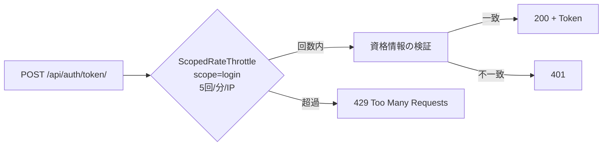

# Chapter 08: Rate Limiting

## この章の目的

ログインエンドポイントを連打し、一定回数で `429` に切り替わることを確認する。Rate Limit が何を守り、何を守らないかを整理する。

## 現在地

Setup → Authentication → Authorization → **Hardening** → Verification → Review

## 完了条件

- [ ] 連続ログイン試行が `429` で遮断される
- [ ] `429` のレスポンスに待機時間が含まれる
- [ ] Rate Limit が認証・認可の代わりにならない理由を説明できる

---

## この章の範囲



throttle は資格情報の検証より**前**に動く。正しいパスワードを送っても、回数を超えていれば `429` になる。

---

## 設定

```python
# config/settings.py
REST_FRAMEWORK = {
    ...
    "DEFAULT_THROTTLE_CLASSES": [
        "rest_framework.throttling.ScopedRateThrottle",
    ],
    "DEFAULT_THROTTLE_RATES": {
        "login": os.environ.get("LOGIN_RATE", "5/min"),
    },
}
```

```python
# accounts/views.py
class AuditedTokenObtainPairView(TokenObtainPairView):
    throttle_scope = "login"
```

`ScopedRateThrottle` は `throttle_scope` を持つ View にだけ適用される。Document API 側には設定していないため、ハンズオン中の他の操作は制限されない。

---

## Step 1. 既定の制限値を確認する

### やること

`LOGIN_RATE` が `5/min` になっていることを確認する。

### 実行

```bash
cd secure-api-hands-on
grep LOGIN_RATE .env
```

### 期待結果

```text
LOGIN_RATE=5/min
```

Chapter 06 で一時的に上げていた場合は `5/min` に戻し、`docker compose up -d api` を実行する。

---

## Step 2. ログインを連打する

### やること

誤ったパスワードで12回続けて試行し、ステータスの変化を見る。

### 実行

```bash
for i in $(seq 1 12); do
  code=$(curl -s -o /dev/null -w "%{http_code}" \
    -X POST http://localhost:8000/api/auth/token/ \
    -H "Content-Type: application/json" \
    -d '{"username":"alice","password":"wrong-password"}')
  echo "attempt ${i} -> ${code}"
done
```

### 期待結果

```text
attempt 1 -> 401
attempt 2 -> 401
attempt 3 -> 401
attempt 4 -> 401
attempt 5 -> 401
attempt 6 -> 429
attempt 7 -> 429
attempt 8 -> 429
attempt 9 -> 429
attempt 10 -> 429
attempt 11 -> 429
attempt 12 -> 429
```

> [!NOTE]
> 切り替わる回数は、直前1分間に何回ログインしたかで変わる。Token 取得のために既にログインしていれば、その分だけ早く `429` になる（4回目など）。回数そのものより、**ある時点で `401` から `429` へ変わる**ことを確認する。

---

## Step 3. レスポンスの中身を見る

### やること

`429` の本文を確認する。

### 実行

```bash
curl -s -X POST http://localhost:8000/api/auth/token/ \
  -H "Content-Type: application/json" \
  -d '{"username":"alice","password":"wrong-password"}'
```

### 期待結果

```json
{"detail":"Request was throttled. Expected available in 59 seconds."}
```

待機時間が返る。クライアントはこれを見て再試行の間隔を決められる。

### なぜ行うのか

`401` と `429` は攻撃者に与える情報が違う。`401` は「試行を続ければよい」だが、`429` は「この経路は費用対効果が悪い」という情報になる。総当たりを不可能にするのではなく、**割に合わなくする**のが目的になる。

---

## Step 4. 正しいパスワードでも遮断されることを確認する

### やること

制限に達した状態で、正しい資格情報を送る。

### 実行

```bash
curl -s -X POST http://localhost:8000/api/auth/token/ \
  -H "Content-Type: application/json" \
  -d '{"username":"alice","password":"Handson-Passw0rd!"}' \
  -w "\nstatus=%{http_code}\n"
```

### 期待結果

```json
{"detail":"Request was throttled. Expected available in 46 seconds."}
```

```text
status=429
```

正規利用者も巻き込まれる。これが Rate Limit のコストになる。

<details>
<summary>この副作用をどう扱うか</summary>

既定の `ScopedRateThrottle` は IP 単位で数える。同じ NAT や社内プロキシの背後にいる利用者は、互いの試行を消費し合う。実運用では次のような調整が必要になる。

- 「IP 単位」と「username 単位」を併用し、後者をより厳しくする
- 失敗したときだけカウントし、成功時はカウンタをリセットする
- 段階的に遅延を入れる（1回目は即時、5回目は2秒待たせる）
- 閾値を超えたら CAPTCHA や追加認証へ倒す

また DRF 既定の throttle はキャッシュ（このハンズオンではプロセス内メモリ）に依存する。API を複数プロセス・複数インスタンスで動かすとカウンタが共有されず、実効的な上限が台数倍になる。本番では Redis などの共有キャッシュを使う。

</details>

---

## Rate Limit が守るもの・守らないもの

| 攻撃 | Rate Limit の効果 |
|---|---|
| パスワード総当たり | 有効。試行速度を落とす |
| 流出パスワードの使い回し（Credential Stuffing） | 部分的。IP を分散されると効きにくい |
| ID を書き換えた総当たり（Ch05 の BOLA） | 発見を遅らせるだけ。認可が抜けていれば最終的に抜かれる |
| 認可の欠落 | **効果なし** |

Rate Limit は認証・認可の**代わりにはならない**。1回のリクエストで他人のデータが取れるなら、回数を制限しても漏洩は起きる。

守っているのは「同じ操作を大量に繰り返すこと」であって、「その操作をしてよいかどうか」ではない。

---

## この章で確認したこと

| 状況 | ステータス |
|---|---|
| 制限内・誤ったパスワード | `401` |
| 制限超過・誤ったパスワード | `429` |
| 制限超過・正しいパスワード | `429` |

---

## 次の章

[Chapter 09: CORS を確認する](./chapter09-cors.md)
