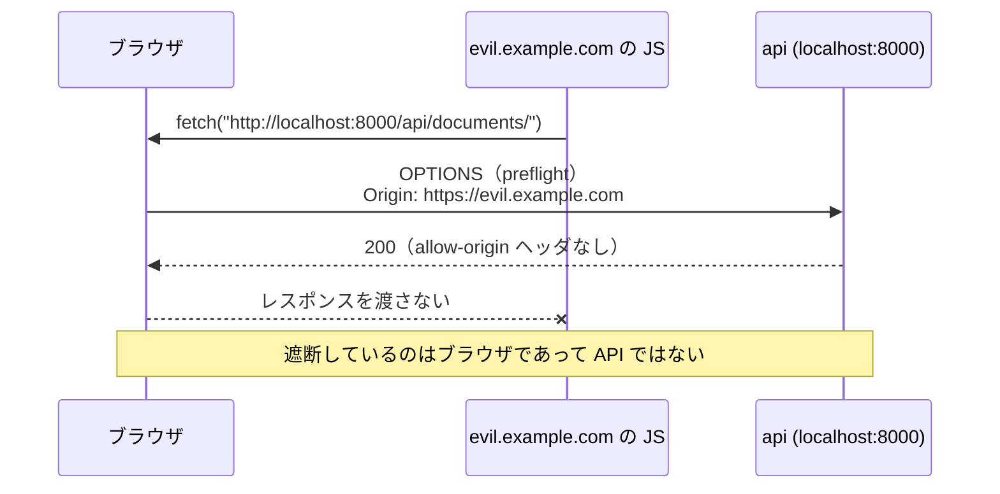

# Chapter 09: CORS を確認する

## この章の目的

許可していない Origin からのリクエストを、preflight と実リクエストの両方で確認する。CORS が API の認可機構ではないことを、応答で確かめる。

## 現在地

Setup → Authentication → Authorization → **Hardening** → Verification → Review

## 完了条件

- [ ] 許可 Origin の preflight に `access-control-allow-origin` が付く
- [ ] 未許可 Origin の preflight にそのヘッダが付かない
- [ ] 未許可 Origin を付けた curl のリクエストが `200` で通る

---

## CORS はどこで効くのか



CORS は「ブラウザが、別 Origin のレスポンスを JavaScript に渡してよいか」を決める仕組み。判断も遮断もブラウザ側で行われる。

したがって、ブラウザを経由しないクライアント（curl / Python / サーバー間通信 / 改造クライアント）には何の制約にもならない。

---

## 設定

```python
# config/settings.py
# CORS はブラウザ側の制約であり、API の認可機構ではない
CORS_ALLOWED_ORIGINS = [
    origin.strip()
    for origin in os.environ.get("CORS_ALLOWED_ORIGINS", "https://app.example.com").split(",")
    if origin.strip()
]
```

既定で許可しているのは `https://app.example.com` のみ。

---

## Step 1. 許可 Origin の preflight

### やること

許可済み Origin からの事前確認リクエストを送る。

### 実行

```bash
curl -s -i -X OPTIONS http://localhost:8000/api/documents/ \
  -H "Origin: https://app.example.com" \
  -H "Access-Control-Request-Method: GET" \
  -H "Access-Control-Request-Headers: authorization" \
  | grep -iE "^HTTP/|^access-control"
```

### 期待結果

```http
HTTP/1.1 200 OK
access-control-allow-origin: https://app.example.com
access-control-allow-headers: accept, authorization, content-type, user-agent, x-csrftoken, x-requested-with
access-control-allow-methods: DELETE, GET, OPTIONS, PATCH, POST, PUT
access-control-max-age: 86400
```

`access-control-allow-origin` が返ったので、ブラウザは本番のリクエストへ進み、その結果を JavaScript に渡す。

---

## Step 2. 未許可 Origin の preflight

### やること

Origin だけを変えて、同じリクエストを送る。

### 実行

```bash
curl -s -i -X OPTIONS http://localhost:8000/api/documents/ \
  -H "Origin: https://evil.example.com" \
  -H "Access-Control-Request-Method: GET" \
  -H "Access-Control-Request-Headers: authorization" \
  | grep -iE "^HTTP/|^access-control"
```

### 期待結果

```http
HTTP/1.1 200 OK
```

`access-control-*` ヘッダが1つも返らない。

ここが誤解しやすい点になる。**ステータスは `200` のまま**で、API はリクエストを拒否していない。ヘッダが無いことを見て、ブラウザが JavaScript へのレスポンス受け渡しを止める。

---

## Step 3. curl から未許可 Origin で本番リクエストを送る

### やること

`Origin: https://evil.example.com` を付けたまま、実際にデータを取得する。

### 実行

```bash
ALICE=$(curl -s -X POST http://localhost:8000/api/auth/token/ \
  -H "Content-Type: application/json" \
  -d '{"username":"alice","password":"Handson-Passw0rd!"}' \
  | python -c "import sys,json;print(json.load(sys.stdin)['access'])")

curl -s http://localhost:8000/api/documents/ \
  -H "Origin: https://evil.example.com" \
  -H "Authorization: Bearer ${ALICE}" \
  -w "\nstatus=%{http_code}\n"
```

### 期待結果

```json
[{"id":1,"title":"Alice Private Note","content":"alice しか読めないはずの内容","owner":1,"created_at":"..."}]
```

```text
status=200
```

> [!IMPORTANT]
> 許可していない Origin を名乗っていても、データは返ってくる。CORS 設定は API のアクセス制御として機能していない。

### なぜ行うのか

「CORS を設定したので外部からは叩けない」という誤解は実際によく起きる。この1回のリクエストが、その誤解を直接否定する。

守れるのは「利用者のブラウザで動く、悪意あるサイトの JavaScript」だけ。攻撃者が自分の手元で実行するプログラムには届かない。

---

## CORS / CSRF / 認証 / 認可の役割

| 仕組み | 守る対象 | 判断する場所 | 迂回できるか |
|---|---|---|---|
| CORS | 他サイトの JS が**レスポンスを読む**こと | ブラウザ | curl などで迂回できる |
| CSRF 対策 | 他サイトが利用者の**Cookie を使って書き込む**こと | サーバー | Cookie 認証でなければ該当しない |
| 認証 | 誰であるかの確認 | サーバー | できない |
| 認可 | その操作・そのデータを扱ってよいか | サーバー | できない |

### このハンズオンで CSRF を扱わない理由

CSRF は、ブラウザが**自動で付与する資格情報**（Cookie / Basic 認証）を悪用する攻撃になる。このAPIは Cookie を使わず、`Authorization: Bearer` ヘッダを明示的に付ける方式のため、他サイトが利用者になりすましてリクエストを送っても Token は付かない。

ただし「JWT を使えば CSRF は無関係」ではない。**Token を Cookie に保存すると、Cookie 認証と同じ条件に戻る**。その場合は `SameSite` 属性や CSRF トークンが必要になる。Token をどこに置くかで、必要な対策が変わる。

---

## この章で確認したこと

| リクエスト | 結果 |
|---|---|
| preflight（`app.example.com`） | `200` + `access-control-allow-origin` |
| preflight（`evil.example.com`） | `200`、CORS ヘッダなし |
| curl + `Origin: evil.example.com` + 有効 Token | `200`、データが返る |

---

## 次の章

[Chapter 10: 監査ログ](./chapter10-security-logging.md)
