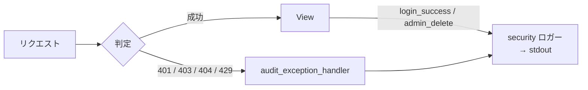

# Chapter 10: 監査ログ

## この章の目的

Chapter 04〜08 で起こした拒否イベントがログに残ることを確認し、同時に Token やパスワードが残っていないことを確認する。

## 現在地

Setup → Authentication → Authorization → **Hardening** → Verification → Review

## 完了条件

- [ ] 認証失敗・認可失敗・Rate Limit・admin 操作がログに現れる
- [ ] ログに password / access token / refresh token が含まれていない
- [ ] 他人のリソースへのアクセスが `404` でも記録されることを確認した

---

## 攻撃されたことが分からないAPI

Chapter 05 の BOLA には、検知しにくい性質がある。

```text
攻撃者から見た操作 : GET /api/documents/2/
サーバーのログ     : 200 OK
```

正常なリクエストと区別がつかない。異常が記録されるのは、**拒否したとき**になる。つまり認可を実装して初めて、攻撃の痕跡がログに残るようになる。



---

## 記録するイベント

| イベント | レベル | 発生条件 |
|---|---|---|
| `login_success` | INFO | ログイン成功 |
| `login_failure` | WARNING | 資格情報の誤り |
| `authentication_failure` | WARNING | Token なし / 改ざん / 期限切れ |
| `authorization_failure` | WARNING | role 不足などで `403` |
| `resource_not_found` | WARNING | 他人のリソースへのアクセス（`404`） |
| `rate_limit_exceeded` | WARNING | `429` |
| `admin_delete` | INFO | admin による削除 |

`login_failure` と `authentication_failure` を分けているのは、調べたい対象が違うため。前者はパスワード総当たり、後者は Token の不正利用を示す。

---

## 実装

401 / 403 / 404 / 429 は DRF の例外ハンドラで一括して捕まえる。各 View に書くと、書き忘れた場所だけ記録が抜ける。

```python
# config/audit.py
def audit_exception_handler(exc, context):
    response = exception_handler(exc, context)
    ...
    if isinstance(exc, (NotAuthenticated, AuthenticationFailed)):
        log_event(logging.WARNING, "authentication_failure", **common)
    elif isinstance(exc, PermissionDenied):
        log_event(logging.WARNING, "authorization_failure", **common)
    elif isinstance(exc, Throttled):
        log_event(logging.WARNING, "rate_limit_exceeded", retry_after=exc.wait, **common)
    elif isinstance(exc, (NotFound, Http404)):
        log_event(logging.WARNING, "resource_not_found", **common)

    return response
```

```python
# config/settings.py
REST_FRAMEWORK = {
    ...
    "EXCEPTION_HANDLER": "config.audit.audit_exception_handler",
}
```

<details>
<summary>実装中に見つかった取りこぼし：Http404 と NotFound</summary>

最初の実装では `rest_framework.exceptions.NotFound` だけを見ていたため、`resource_not_found` が一度も記録されなかった。

DRF の `get_object()` は内部で Django の `get_object_or_404` を使い、送出されるのは `django.http.Http404` になる。DRF はこれを `404` レスポンスへ変換するが、例外ハンドラに渡される `exc` は `Http404` のままで、`NotFound` ではない。

Chapter 06 の QuerySet スコープによる拒否は**すべて `404`** なので、この取りこぼしは「オブジェクト認可による拒否がまったく記録されない」ことを意味していた。ログの実装は、**書いただけでは検証にならない**。実際にイベントを起こして出力を確認する必要がある。

</details>

秘密情報の混入は、フィールド名で弾いている。

```python
# config/audit.py
FORBIDDEN_FIELDS = {"password", "token", "access", "refresh", "secret", "authorization"}

def log_event(level: int, event: str, **fields) -> None:
    leaked = FORBIDDEN_FIELDS & set(fields)
    if leaked:
        raise ValueError(f"監査ログに秘密情報を渡そうとしました: {sorted(leaked)}")
    ...
```

黙って除外せず例外にしているのは、開発中に気づけるようにするため。除外すると、ログに出ていないことを誰も確認しないまま進む。

---

## Step 1. イベントを一通り発生させる

### やること

拒否されるリクエストを続けて送る。

### 実行

```bash
cd secure-api-hands-on
API=http://localhost:8000

ALICE=$(curl -s -X POST $API/api/auth/token/ -H "Content-Type: application/json" \
  -d '{"username":"alice","password":"Handson-Passw0rd!"}' \
  | python -c "import sys,json;print(json.load(sys.stdin)['access'])")
ROOT=$(curl -s -X POST $API/api/auth/token/ -H "Content-Type: application/json" \
  -d '{"username":"root","password":"Handson-Passw0rd!"}' \
  | python -c "import sys,json;print(json.load(sys.stdin)['access'])")

curl -s -o /dev/null $API/api/documents/2/ -H "Authorization: Bearer ${ALICE}"          # 他人のデータ → 404
curl -s -o /dev/null -X DELETE $API/api/documents/1/ -H "Authorization: Bearer ${ALICE}" # role 不足 → 403
curl -s -o /dev/null -X DELETE $API/api/documents/1/ -H "Authorization: Bearer ${ROOT}"  # admin 削除 → 204
curl -s -o /dev/null $API/api/documents/                                                 # Token なし → 401
```

### 期待結果

標準出力には何も出ない。ログはコンテナ側へ出力される。

---

## Step 2. ログを読む

### やること

security ロガーの出力だけを抜き出す。

### 実行

```bash
docker compose logs api --since 2m \
  | grep -E "login_|authentication_failure|authorization_failure|resource_not_found|admin_delete|rate_limit"
```

### 期待結果

```text
2026-09-16T06:28:06+0000 WARNING authentication_failure method=GET path=/api/documents/ ip=172.28.0.1 status=401
2026-09-16T06:28:08+0000 INFO login_success username=alice ip=172.28.0.1 path=/api/auth/token/ status=200
2026-09-16T06:28:09+0000 WARNING resource_not_found user_id=1 method=GET path=/api/documents/2/ ip=172.28.0.1 status=404
2026-09-16T06:28:09+0000 WARNING authorization_failure user_id=1 method=DELETE path=/api/documents/1/ ip=172.28.0.1 status=403
2026-09-16T06:28:09+0000 INFO login_success username=root ip=172.28.0.1 path=/api/auth/token/ status=200
2026-09-16T06:28:09+0000 INFO admin_delete user_id=3 resource=document:1 ip=172.28.0.1
```

### 読み方

3行目が重要になる。

```text
resource_not_found user_id=1 method=GET path=/api/documents/2/ status=404
```

`user_id=1`（alice）が `documents/2`（bob のデータ）を取りに来て、拒否された記録になる。単独では入力ミスと区別がつかないが、**同じ user_id から連番の path へ 404 が並べば**、ID の総当たりだと判断できる。

Chapter 05 の脆弱な状態では、この行は `200` として残り、区別がつかなかった。認可を実装したことで、初めて攻撃が可視化されている。

`resource=document:1` のように**どのリソースか**を残しているのも同じ理由で、「何が起きたか」だけでは事後調査ができない。

---

## Step 3. 秘密情報が残っていないことを確認する

### やること

パスワードと Token の断片をログ全体から検索する。

### 実行

```bash
docker compose logs api | grep -cE "Handson-Passw0rd|eyJhbGciOiJIUzI1NiIsInR5cCI6IkpXVCJ9"
```

### 期待結果

```text
0
```

一致する行がなければ `0` が返る。

### なぜ行うのか

監査ログは、アクセス範囲が本番DBより広くなりやすい（運用者・監視基盤・ログ収集SaaS）。Token がログに残ると、**ログを読める人が全員そのユーザーになりすませる**。ログは秘密情報の新しい保管場所になってはいけない。

同じ理由で、リクエストボディをそのまま出力するミドルウェアも避ける。パスワードもクレジットカード番号も、そこを通れば残る。

---

## Step 4. 後始末

Chapter 11 で Document 1 を使うため、データを戻す。

```bash
docker compose exec api uv run python manage.py seed_demo
```

---

## 実運用で足りないもの

このハンズオンのログは標準出力への出力で止めている。実際に運用するには次が必要になる。

| 項目 | 理由 |
|---|---|
| 構造化（JSON Lines） | 検索・集計するため。`key=value` は目視向け |
| 相関ID（request_id） | 1リクエストの処理を横断して追うため |
| 保全（改ざん防止・保持期間） | 侵入者にログを消されないため。攻撃の発覚は数か月後のことがある |
| 集約と検知ルール | 「同一 user_id から 404 が1分に50件」で通知するため |
| ログ自体のアクセス制御 | ログを読める人の範囲を限定するため |

「ログを出す」ことと「攻撃を検知できる」ことの間には、まだ距離がある。

---

## この章で確認したこと

| 操作 | ステータス | 記録されるイベント |
|---|---|---|
| Token なしでアクセス | `401` | `authentication_failure` |
| 誤ったパスワード | `401` | `login_failure` |
| role 不足の DELETE | `403` | `authorization_failure` |
| 他人のリソース | `404` | `resource_not_found` |
| ログイン連打 | `429` | `rate_limit_exceeded` |
| admin による削除 | `204` | `admin_delete` |
| password / token の出力 | — | 0件 |

---

## 次の章

[Chapter 11: 正常系・異常系テスト](./chapter11-verification.md)
