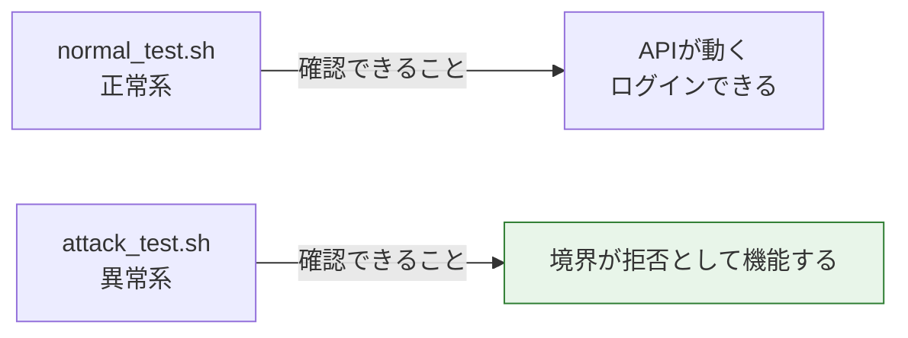
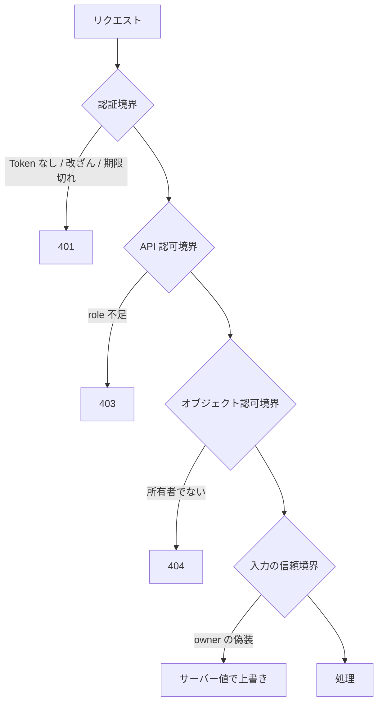

# Chapter 11: 正常系・異常系テスト

## この章の目的

ここまで章ごとに手で確認してきた挙動を、2本のスクリプトで一括検証する。境界が全部そろって機能していることを、1回の実行で確かめられる状態にする。

## 現在地

Setup → Authentication → Authorization → Hardening → **Verification** → Review

## 完了条件

- [ ] `normal_test.sh` が PASS=6 FAIL=0 で終わる
- [ ] `attack_test.sh` が PASS=9 FAIL=0 で終わる
- [ ] 正常系だけでは何が確認できないかを説明できる

---

## 2種類のテストの役割



正常系テストだけを書くと、**Chapter 05 の脆弱なAPIも全部 PASS する**。alice は自分のデータを取得でき、ログインでき、作成もできるため、正常系の観点では何も壊れていない。

セキュリティは、通ることではなく**拒否されること**でしか確認できない。

---

## Step 1. 前提を整える

### やること

フラグが既定値であることを確認し、データを初期化する。

### 実行

```bash
cd secure-api-hands-on
grep INSECURE .env
docker compose exec api uv run python manage.py seed_demo
```

### 期待結果

```text
INSECURE_NO_AUTH=0
INSECURE_OBJECT_ACCESS=0
INSECURE_OBJECT_PERMISSION=0
INSECURE_MASS_ASSIGNMENT=0
```

4つとも `0` でなければ、`.env` を直して `docker compose up -d api` を実行する。

---

## Step 2. 正常系テストを実行する

### やること

想定どおりの操作が想定どおり通ることを確認する。

### 実行

```bash
bash scripts/normal_test.sh
```

### 期待結果

```text
=== 正常系テスト (API=http://localhost:8000) ===
  [PASS] ログイン成功               expected=200   actual=200
  [PASS] 自分の識別情報を取得       expected=200   actual=200
  [PASS] 自分の Document 一覧       expected=200   actual=200
  [PASS] 自分の Document 取得       expected=200   actual=200
  [PASS] Document 作成              expected=201   actual=201
  [PASS] admin による DELETE        expected=204   actual=204

--------------------------------------------------
  PASS=6  FAIL=0
--------------------------------------------------
```

> [!NOTE]
> このスクリプトは Document 1 を削除する。続けて異常系を実行する前に `seed_demo` でデータを戻す。

---

## Step 3. 異常系テストを実行する

### やること

境界を破ろうとする操作が、想定どおり拒否されることを確認する。

### 実行

```bash
docker compose exec api uv run python manage.py seed_demo
bash scripts/attack_test.sh
```

### 期待結果

```text
=== 異常系テスト (API=http://localhost:8000) ===

--- 認証境界 ---
  [PASS] Token なし                  expected=401       actual=401
  [PASS] Token 改ざん                expected=401       actual=401
  [PASS] Bearer プレフィックスなし   expected=401       actual=401
  [PASS] パスワード誤り              expected=401       actual=401

--- 認可境界（API Permission / RBAC） ---
  [PASS] role=user による DELETE     expected=403       actual=403

--- 認可境界（Object-Level） ---
  [PASS] 他人の Document を GET      expected=403|404   actual=404
  [PASS] 他人の Document を PATCH    expected=403|404   actual=404

--- 入力の信頼（Mass Assignment） ---
  [PASS] owner 指定が無視される (owner=1) expected=1    actual=1

--- Rate Limit ---
  attempt 1  -> 401
  attempt 2  -> 401
  attempt 3  -> 401
  attempt 4  -> 429
  ...
  [PASS] 連続ログインが 429 で遮断される expected=[0-9]+ actual=4

--------------------------------------------------
  PASS=9  FAIL=0
--------------------------------------------------
```

`429` に切り替わる回数は、直前1分間のログイン回数によって変わる。スクリプトは**最初に `429` が出た回数**を記録して判定するため、4回目でも6回目でも PASS する。

正常系テストの直後に実行した場合は、そちらで使ったログイン回数が残っているため、1回目から `429` になることもある。

```text
--- Rate Limit ---
  attempt 1  -> 429
  ...
  [PASS] 連続ログインが 429 で遮断される expected=[0-9]+ actual=1
```

Rate Limit の切り替わり方そのものを見たい場合は、1分あけてから実行するか、[Chapter 08](./chapter08-rate-limit.md) の手順を単独で実行する。

---

## テストが何を見ているか



異常系テストの9項目は、この4つの境界に対応している。どれか1つの実装を外すと、対応するテストが落ちる。

### 実際に落とせることを確認する

フラグを1つ戻すと、対応する項目だけが FAIL になる。

```bash
sed -i 's|^INSECURE_OBJECT_ACCESS=.*|INSECURE_OBJECT_ACCESS=1|; s|^INSECURE_OBJECT_PERMISSION=.*|INSECURE_OBJECT_PERMISSION=1|' .env
docker compose up -d api
docker compose exec api uv run python manage.py seed_demo
bash scripts/attack_test.sh
```

「オブジェクト認可境界」の2項目が FAIL に変わる。テストが本当に守っている対象を検出しているかは、こうして**壊して確認する**のが確実になる。

確認後は戻す。

```bash
sed -i 's|^INSECURE_OBJECT_ACCESS=.*|INSECURE_OBJECT_ACCESS=0|; s|^INSECURE_OBJECT_PERMISSION=.*|INSECURE_OBJECT_PERMISSION=0|' .env
docker compose up -d api
docker compose exec api uv run python manage.py seed_demo
```

---

## スクリプトの構造

判定は `expect` に集約している。

```bash
# scripts/lib.sh
expect() {
  # $1: ラベル / $2: 期待するステータス（| 区切りで複数可） / $3: 実際のステータス
  local label="$1" want="$2" got="$3"
  if echo "$got" | grep -qE "^(${want})$"; then
    printf '  [PASS] %-44s expected=%-9s actual=%s\n' "$label" "$want" "$got"
    PASS=$((PASS + 1))
  else
    printf '  [FAIL] %-44s expected=%-9s actual=%s\n' "$label" "$want" "$got"
    FAIL=$((FAIL + 1))
  fi
}
```

オブジェクト認可の期待値を `403|404` としているのは、Chapter 06 で触れたとおり**どちらを返すかが設計判断**のため。`404` に固定すると、`403` を選んだ実装へ流用したときに誤検知する。

---

## 異常系テストの一覧

| 境界 | テスト | 期待 |
|---|---|---|
| 認証 | Token なし | `401` |
| 認証 | Token 改ざん | `401` |
| 認証 | Bearer プレフィックスなし | `401` |
| 認証 | パスワード誤り | `401` |
| API 認可 | role=user による DELETE | `403` |
| オブジェクト認可 | 他人の Document を GET | `403` / `404` |
| オブジェクト認可 | 他人の Document を PATCH | `403` / `404` |
| 入力の信頼 | `owner` の偽装 | サーバー値で上書き |
| Rate Limit | ログイン連打 | `429` |

Chapter 03 の期限切れ Token は、70秒の待機が必要なためスクリプトに含めていない。手順は [Chapter 03](./chapter03-token-lifecycle.md) を参照。

---

## 次の章

[Chapter 12: 振り返りと設計判断](./chapter12-review.md)
