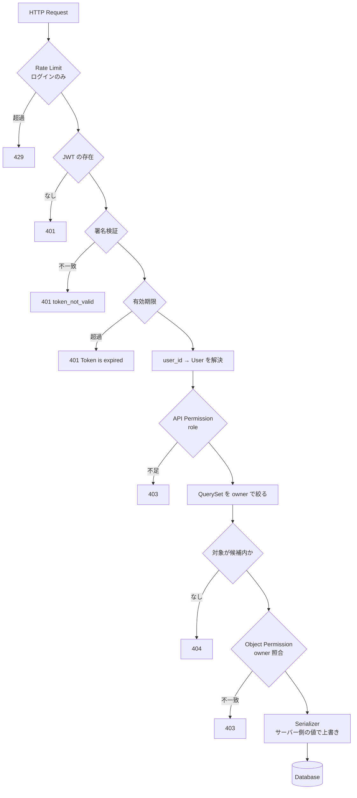

# Chapter 12: 振り返りと設計判断

## この章の目的

実装した防御を1つのリクエスト処理として並べ直し、選んだ設計とそのトレードオフを整理する。環境を片付けて終わる。

## 現在地

Setup → Authentication → Authorization → Hardening → Verification → **Review**

## 完了条件

- [ ] リクエストが通る層と、各層が拒否する条件を説明できる
- [ ] このハンズオンで選んだ設計の代替案と理由を説明できる
- [ ] コンテナとボリュームを削除した

---

## 最終的なリクエスト処理



JWT が関わっているのは `T2`〜`T5` だけになる。認証は全体の一部でしかない。

---

## 各章で足したものと、守られるようになったもの

| 章 | 追加したもの | それまで通っていた攻撃 |
|---|---|---|
| 02 | JWT 認証 | 匿名での全データ取得 |
| 03 | Token の寿命と再発行 | 盗まれた Token の無期限利用 |
| 04 | role による API 認可 | 一般利用者による削除 |
| 06 | QuerySet スコープ + Object Permission | 他人のデータの取得・改ざん（BOLA） |
| 07 | `read_only_fields` + サーバー側での owner 決定 | 他人名義でのデータ作成・所有権の付け替え |
| 08 | Rate Limit | パスワード総当たり |
| 10 | 監査ログ | 攻撃に気づけないこと |

Chapter 02 の時点で「ログインできるAPI」は完成していた。そこから Chapter 10 までが「安全なAPI」との差になる。

---

## 設計判断

| 判断 | 選択肢 | 選んだもの | 理由 |
|---|---|---|---|
| 認証方式 | Session / JWT | JWT | API・SPA・サーバー間通信で扱いが同じになる。Token の中身を自分で確認できる |
| JWT 実装 | 自作 / SimpleJWT | SimpleJWT | 署名・期限検証を自作しない。暗号処理の自作は事故の元になる |
| 認可の置き場所 | View 内の if / Permission クラス | Permission クラス | 判定が1箇所に集まり、適用状況を `permission_classes` で一覧できる |
| データ取得 | 全件取得 / owner スコープ | owner スコープ | 一覧APIの漏洩は Object Permission では防げない（Ch06 Step 3） |
| owner の決定 | クライアント指定 / サーバー指定 | サーバー指定 | 帰属をクライアントに決めさせない |
| 他人のリソースへの応答 | 403 / 404 | 404 | ID の存在を漏らさない。ただし要件次第 |
| role の持たせ方 | `is_staff` 流用 / 独自の `role` | 独自の `role` | 管理画面の権限とAPIの権限を混同しない |
| 認証基盤 | Cognito / Auth0 / 自前 | 自前 | 外部サービスでも Object 認可は自動で解決しないため、まず API 側の責務を理解する |
| DB | SQLite / PostgreSQL | PostgreSQL | 実運用に近い制約で確認する |

### Cognito や Auth0 を最初から使わない理由

これらを導入すると、Chapter 02・03・08（認証、Token 管理、ログインの Rate Limit）は肩代わりされる。一方で Chapter 04・06・07（RBAC、オブジェクト認可、Mass Assignment）は**API 側の責務として残る**。

つまり、認証基盤を入れても Chapter 05 の BOLA はそのまま成立する。境界がどこにあるかを理解してから導入するほうが、設定の意味が分かる。

---

## トレードオフ

### JWT

| | |
|---|---|
| **利点** | サーバーがセッションを保持しない。水平スケールしやすい。認証サーバーを分離しやすい |
| **代償** | 発行済み Token を即座に無効化できない。Token の保管場所をクライアント側で設計する必要がある |

即時失効が必要なら、Blacklist（`token_blacklist`）の導入、寿命の短縮、重要操作での再認証のいずれかを足す。これらは「Stateless である」という利点を部分的に手放す選択になる。

### Token の保管場所

| 保管場所 | リスク | 必要な対策 |
|---|---|---|
| `localStorage` | XSS で盗まれる | CSP、入力のエスケープ |
| Cookie（HttpOnly） | CSRF の対象に戻る | `SameSite`、CSRF トークン |
| メモリのみ | リロードで消える | Refresh の設計 |

どれにも弱点がある。「JWT なら安全」ではなく、選んだ保管場所に応じた対策が要る（Chapter 09）。

### RBAC

role は理解しやすく、権限の説明もしやすい。一方で条件が増えると role の数が急増する（Role Explosion）。

```text
Admin / User / Viewer
  ↓ 「部門Aの管理者、部門Bでは閲覧のみ」
TenantAdmin / DeptAAdmin / DeptBViewer / ...
```

role で表しきれなくなったら、属性で判定する ABAC やポリシーエンジン（OPA など）を検討する段階になる。ただし、ABAC は「誰が何をできるか」を一覧しにくくなる。運用で説明できるかどうかが分かれ目になる。

---

## このハンズオンが答えたこと

### JWT を導入すればAPIは安全か

いいえ。JWT が答えるのは「誰か」だけで、「何をしてよいか」「どのデータを扱ってよいか」には答えない（Chapter 05）。

### 認証済みならAPIを自由に呼ばせてよいか

いいえ。「認証済みユーザーのみ許可」は、**全利用者を等しく信頼する**という意味になる。利用者が2人以上いれば、それはほぼ無制限と同じになる（Chapter 04・06）。

### URL の ID を書き換えるだけの攻撃を防げるか

JWT だけでは防げない。データ1件ごとの所有者照合と、取得段階での絞り込みの両方がいる（Chapter 06）。

### 安全なAPI設計で重要なのは何か

次の3つを別の判断として分けること。1つにまとめようとすると、どれかが抜ける。

```text
Identity           誰か
Permission         何をしてよいか
Resource Ownership どのデータを扱ってよいか
```

---

## 次にやること

### 1. 認証基盤の分離（Cognito / OAuth 2.0 / OIDC）

```text
現在                          次
Django                        Identity Provider
 └─ 認証 + 認可                 └─ 認証（JWT 発行）
                              Django API
                               └─ 認可（そのまま残る）
```

認証を外に出しても、Chapter 04・06・07 の実装は残る。それを確認するのが目的になる。

### 2. マルチテナント認可

所有関係を一段深くする。

```text
現在 : User → Resource
次   : User → Tenant → Resource
```

`tenant_id` を Token に含めるか、DBから引くかが設計判断になる。Token に入れると、テナント移動時に古い Token が残る問題が出る。

### 3. OWASP API Security Top 10 に沿った検証

このハンズオンで扱ったのは、次の項目に対応する。

| OWASP API Security Top 10 | 扱った章 |
|---|---|
| API1: Broken Object Level Authorization | Ch05 / Ch06 |
| API2: Broken Authentication | Ch02 / Ch03 / Ch08 |
| API3: Broken Object Property Level Authorization | Ch07 |
| API5: Broken Function Level Authorization | Ch04 |
| API9: Improper Inventory Management | 未実施 |

残りの項目（リソース消費、SSRF、設定不備など）は、同じ形式で足していける。

---

## Cleanup

### やること

コンテナとボリュームを削除する。

### 実行

```bash
cd secure-api-hands-on
docker compose down -v
```

### 期待結果

```text
 Container secure-api-hands-on-api-1 Stopping
 Container secure-api-hands-on-api-1 Stopped
 Container secure-api-hands-on-api-1 Removing
 Container secure-api-hands-on-api-1 Removed
 Container secure-api-hands-on-db-1 Stopping
 Container secure-api-hands-on-db-1 Stopped
 Container secure-api-hands-on-db-1 Removing
 Container secure-api-hands-on-db-1 Removed
 Network secure-api-hands-on_default Removing
 Volume secure-api-hands-on_pgdata Removing
 Volume secure-api-hands-on_pgdata Removed
 Network secure-api-hands-on_default Removed
```

### 確認

```bash
docker compose ps
docker volume ls | grep secure-api
```

どちらも何も出力しなければ完了。`-v` を付けないと PostgreSQL のボリュームが残り、次回の起動時に古いデータを引き継ぐ。

---

## 費用

すべてローカル環境で完結するため、追加費用は発生しない。

| 区分 | 内容 |
|---|---|
| 固定費 | なし |
| 従量課金 | なし |
| 継続課金 | なし |

Docker イメージ（`python:3.14-slim` と `postgres:17-alpine`）のディスク使用量だけが残る。不要なら `docker image prune` で削除する。

---

## 到達点

このハンズオンの目的は、Django の実装を覚えることではなく、次を自分で追えるようになることにある。

```text
誰なのか
   ↓
何をしてよいのか
   ↓
どのデータを操作してよいのか
   ↓
その境界を破ったとき、本当に拒否されるか
```

最後の1行が要点になる。実装した気になっている防御が、実際に拒否として機能するかは、**壊しに行かないと分からない**。Chapter 05 で攻撃を成立させ、Chapter 06 で同じ攻撃が失敗することを確認したのは、そのための順序だった。

---

[README に戻る](../README.md)
